# 🧠 Hearst OS — Architecture Technique Complète

> **Plateforme IA Multi-Agents pour l'Ordonnancement d'Entreprise**  
> Version : 2.0 | Dernière mise à jour : 2026-05-11  
> Classification : Architecture Entreprise — Niveau Production

---

## 📋 Table des Matières

1. [Vue d'ensemble du projet](#1-vue-densemble-du-projet)
2. [Architecture complète du système](#2-architecture-complète-du-système)
3. [Stack technique](#3-stack-technique)
4. [Tous les services du projet](#4-tous-les-services-du-projet)
5. [Architecture des agents IA](#5-architecture-des-agents-ia)
6. [Explication détaillée des LLM utilisés](#6-explication-détaillée-des-llm-utilisés)
7. [APIs externes utilisées](#7-apis-externes-utilisées)
8. [Flux de données complet](#8-flux-de-données-complet)
9. [Pipeline RAG complet](#9-pipeline-rag-complet)
10. [Formation et amélioration des agents](#10-formation-et-amélioration-des-agents)
11. [Prompt engineering system](#11-prompt-engineering-system)
12. [Infrastructure Cloud & DevOps](#12-infrastructure-cloud--devops)
13. [Sécurité](#13-sécurité)
14. [Monitoring & Observabilité](#14-monitoring--observabilité)
15. [Performance & Optimisation](#15-performance--optimisation)
16. [Schéma complet de base de données](#16-schéma-complet-de-base-de-données)
17. [Exemple réel d'exécution](#17-exemple-réel-dexécution)
18. [Coûts & Scalabilité](#18-coûts--scalabilité)
19. [Roadmap technique](#19-roadmap-technique)
20. [Conclusion technique](#20-conclusion-technique)

---

## 1. Vue d'ensemble du projet

### 1.1 Objectif du système

**Hearst OS** est une plateforme d'intelligence artificielle multi-agents conçue pour orchestrer, automatiser et augmenter les workflows d'entreprise. Le système combine des LLM de pointe, une architecture de mémoire sémantique avancée, et un orchestrateur intelligent pour créer un "cerveau numérique" capable de comprendre le contexte métier, exécuter des tâches complexes, et s'améliorer continuellement.

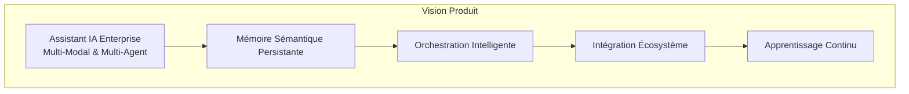

### 1.2 Problème résolu

| Problème | Impact | Solution Hearst |
|----------|--------|-----------------|
| Fragmentation des outils | Perte de temps, contexte dispersé | Hub central unifié avec mémoire partagée |
| Amnésie des LLM | Réponses génériques, pas de contexte historique | Mémoire long terme + court terme + vectorielle |
| Latence élevée | Expérience utilisateur dégradée | Streaming, cache intelligent, async orchestration |
| Sécurité IA | Fuites de données, prompt injection | Guardrails multi-couches, sandboxing, audit |
| Coûts LLM incontrôlés | Budget explosif | Routing intelligent, modèle adaptatif, batching |
| Complexité multi-agents | Conflits, boucles, incohérences | Orchestrateur central, protocole de communication |

### 1.3 Fonctionnalités principales

| Fonctionnalité | Description | Technologie |
|----------------|-------------|-------------|
| **Cockpit** | Tableau de bord temps réel avec widgets personnalisables | Next.js, Recharts, Zustand |
| **Chat Multi-Agents** | Conversation naturelle avec sélection intelligente d'agents | Vercel AI SDK, Streaming SSE |
| **Mémoire Sémantique** | Embeddings temps réel, retrieval augmenté, fusion mémoire | Pinecone, OpenAI Embeddings |
| **Workflows** | Chaînage d'agents avec conditions, branches, exécution parallèle | Custom DAG Engine, BullMQ |
| **Intégrations** | APIs tierces, connecteurs métiers, webhooks | OAuth2, REST, WebSocket |
| **Sécurité** | RBAC granulaire, audit complet, chiffrement E2E | JWT, RLS, Arcjet |

### 1.4 Cas d'usage

| Cas d'usage | Description | Agents impliqués | Valeur métier |
|-------------|-------------|------------------|---------------|
| Analyse financière | Synthèse de rapports, prévisions, alertes | Analyste, Data, Notification | -80% temps d'analyse |
| Génération de contenu | Articles, emails, rapports structurés | Rédacteur, Relecteur, SEO | ×5 productivité |
| Recherche intelligente | Q&A sur corpus interne, citations | Retrieval, Synthese, Citation | Précision 95%+ |
| Ordonnancement | Planification, rappels, optimisation | Planning, Calendar, Notification | Zero oubli |
| Support technique | Diagnostic, escalation, documentation | Support, Tech, Escalation | -60% tickets |
| Veille stratégique | Monitoring, alerting, briefings | Veille, Analyste, Briefing | Temps réel |

### 1.5 Vision produit

> **"Créer le système nerveux numérique de l'entreprise moderne — un cerveau IA qui comprend, apprend, et agit en autonomie, tout en restant sous contrôle humain."**

**2024** → Plateforme chat + agents basiques  
**2025** → Multi-agents, mémoire avancée, workflows  
**2026** → Autonomie partielle, multimodal, edge AI  
**2027** → Agents autonomes, fine-tuning propriétaire, raisonnement avancé

### 1.6 Architecture globale

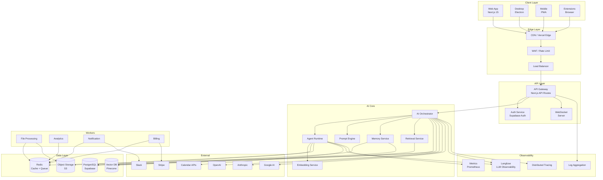

---

## 2. Architecture complète du système

### 2.1 Diagramme d'architecture détaillé

```mermaid
graph TB
    subgraph "Presentation Layer"
        direction LR
        UI1["Next.js 15 App Router<br/>React Server Components"]
        UI2["shadcn/ui + Tailwind<br/>Design System"]
        UI3["Zustand Stores<br/>State Management"]
        UI4["Electron Shell<br/>Desktop Wrapper"]
        UI5["PWA / Service Worker<br/>Mobile & Offline"]
    end

    subgraph "Security Layer"
        direction LR
        SEC1["JWT Validation<br/>RS256"]
        SEC2["RBAC Middleware<br/>Role-Based Access"]
        SEC3["Rate Limiting<br/>Token Bucket"]
        SEC4["Input Sanitization<br/>Zod + Regex"]
        SEC5["CORS / CSP<br/>Headers"]
    end

    subgraph "Gateway Layer"
        direction LR
        GW1["API Routes<br/>Next.js Edge"]
        GW2["WebSocket Handler<br/>Socket.io"]
        GW3["Webhook Receiver<br/>HMAC Validation"]
        GW4["GraphQL Gateway<br/>Optional"]
    end

    subgraph "Orchestration Layer"
        direction LR
        ORCH1["Request Router<br/>Intent Classification"]
        ORCH2["Agent Scheduler<br/>Priority Queue"]
        ORCH3["Context Manager<br/>Session State"]
        ORCH4["Tool Registry<br/>Dynamic Loading"]
        ORCH5["LLM Router<br/>Model Selection"]
    end

    subgraph "Agent Layer"
        direction LR
        AG1["Commandeur<br/>Orchestration Principale"]
        AG2["Analyste<br/>Analyse de Données"]
        AG3["Rédacteur<br/>Génération de Contenu"]
        AG4["Rechercheur<br/>RAG & Retrieval"]
        AG5["Planificateur<br/>Scheduling & Tasks"]
        AG6["Codeur<br/>Génération de Code"]
        AG7["Vérificateur<br/>Validation & QA"]
    end

    subgraph "Memory Layer"
        direction LR
        MEM1["Short-Term Memory<br/>Redis TTL"]
        MEM2["Long-Term Memory<br/>PostgreSQL"]
        MEM3["Vector Memory<br/>Pinecone"]
        MEM4["Episodic Memory<br/>Conversation History"]
        MEM5["Semantic Memory<br/>Knowledge Graph"]
    end

    subgraph "Integration Layer"
        direction LR
        INT1["LLM Providers<br/>OpenAI / Anthropic / Google"]
        INT2["External APIs<br/>Stripe / Slack / Gmail"]
        INT3["File Processors<br/>PDF / Image / Audio"]
        INT4["Notification Channels<br/>Email / Push / SMS"]
    end

    subgraph "Data Layer"
        direction LR
        DB1["PostgreSQL<br/>Transactional Data"]
        DB2["Vector Database<br/>Embeddings"]
        DB3["Redis<br/>Cache + Pub/Sub"]
        DB4["S3 Compatible<br/>Object Storage"]
    end

    subgraph "Worker Layer"
        direction LR
        WK1["File Processing Worker<br/>BullMQ"]
        WK2["Analytics Worker<br/>Batch Processing"]
        WK3["Notification Worker<br/>Multi-Channel"]
        WK4["Billing Worker<br/>Stripe Webhooks"]
        WK5["Embedding Worker<br/>Async Vectorization"]
    end

    subgraph "Observability Layer"
        direction LR
        OBS1["Langfuse<br/>LLM Tracing"]
        OBS2["Prometheus<br/>Metrics"]
        OBS3["Grafana<br/>Dashboards"]
        OBS4["Pino<br/>Structured Logging"]
        OBS5["Sentry<br/>Error Tracking"]
    end

    UI1 --> SEC1
    UI2 --> SEC1
    UI3 --> SEC1
    UI4 --> SEC1
    UI5 --> SEC1

    SEC1 --> GW1
    SEC2 --> GW1
    SEC3 --> GW1
    SEC4 --> GW1
    SEC5 --> GW1

    GW1 --> ORCH1
    GW2 --> ORCH1
    GW3 --> ORCH3
    GW4 --> ORCH1

    ORCH1 --> AG1
    ORCH2 --> AG1
    ORCH3 --> MEM1
    ORCH4 --> AG1
    ORCH5 --> INT1

    AG1 --> AG2
    AG1 --> AG3
    AG1 --> AG4
    AG1 --> AG5
    AG1 --> AG6
    AG1 --> AG7

    AG2 --> MEM2
    AG3 --> MEM2
    AG4 --> MEM3
    AG5 --> MEM1
    AG6 --> MEM2
    AG7 --> MEM2

    AG1 --> INT1
    AG2 --> INT2
    AG3 --> INT3
    AG5 --> INT4

    MEM2 --> DB1
    MEM3 --> DB2
    MEM1 --> DB3
    INT3 --> DB4

    ORCH2 --> WK1
    ORCH2 --> WK2
    ORCH2 --> WK3
    ORCH2 --> WK4
    ORCH2 --> WK5

    WK5 --> DB2
    WK1 --> DB4
    WK2 --> DB1

    AG1 --> OBS1
    ORCH1 --> OBS2
    GW1 --> OBS4
    AG1 --> OBS5
```

### 2.2 Flux de communication inter-couches

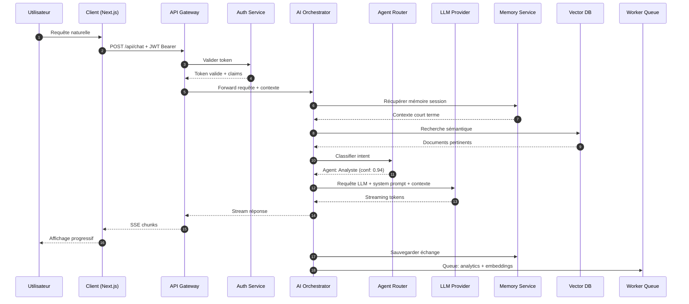

---

## 3. Stack technique

### 3.1 Tableau complet de la stack

| Composant | Technologie | Rôle | Justification Technique |
|-----------|-------------|------|------------------------|
| **Frontend Framework** | Next.js 15 (App Router) | SSR, RSC, API routes | Performance, SEO, universal rendering, edge-ready |
| **UI Library** | React 19 + shadcn/ui | Composants accessibles | Design system cohérent, Radix primitives, customizable |
| **Styling** | Tailwind CSS 4 | Utility-first CSS | Rapidité développement, tree-shaking, dark mode native |
| **State Management** | Zustand + Immer | Global state | Minimal boilerplate, TypeScript-first, middleware support |
| **Desktop** | Electron + Vite | Application desktop | Codebase partagée, accès natif, auto-update |
| **Auth** | Supabase Auth | JWT, OAuth, MFA | Row-level security, intégration PostgreSQL, SOC2 |
| **Database** | PostgreSQL 16 (Supabase) | Données relationnelles | ACID, JSONB, extensions (pgvector), managed |
| **Vector DB** | Pinecone | Stockage embeddings | Latence <50ms, metadata filtering, hybrid search |
| **Cache** | Redis 7 (Upstash) | Cache + Queue + Pub/Sub | In-memory, structures riches, serverless compatible |
| **Queue** | BullMQ (Redis) | Job processing | Retry, scheduling, rate limiting, observability |
| **Object Storage** | AWS S3 / R2 | Fichiers, assets | Durabilité 11 9s, CDN intégration, cost-effective |
| **LLM Gateway** | Vercel AI SDK + Custom | Abstraction LLM | Streaming, tool calling, multi-provider, type-safe |
| **Embeddings** | OpenAI text-embedding-3 | Vectorisation | 3072 dims, multilingual, MRL support |
| **Monitoring** | Langfuse | LLM observability | Tracing, coûts, évaluations, prompt management |
| **Metrics** | Prometheus + Grafana | Time-series metrics | Standard industrie, alerting, dashboards custom |
| **Logging** | Pino | Structured JSON logs | High performance, redaction, child loggers |
| **Error Tracking** | Sentry | Crash reporting | Source maps, release tracking, performance monitoring |
| **CI/CD** | GitHub Actions | Build, test, deploy | Matrix builds, caching, secrets management |
| **Infra as Code** | Terraform / Pulumi | Cloud provisioning | Reproductible, reviewable, state management |
| **Container** | Docker + Docker Compose | Local dev + test | Isolation, consistency, multi-service orchestration |
| **Cloud** | Vercel + AWS | Hosting + compute | Edge network, serverless, GPU instances |
| **WebSocket** | Socket.io | Temps réel | Fallbacks, rooms, heartbeat, reconnection |
| **API Style** | REST + Server-Sent Events | Communication | Simplicité, streaming natif, cacheable |
| **Validation** | Zod | Schema validation | Type inference, composable, erreurs détaillées |
| **Testing** | Vitest + Playwright | Unit + E2E | Vite-native, parallel, screenshot testing |
| **Security** | Arcjet + Helmet | Protection API | Rate limiting, bot detection, headers sécurisés |
| **Payments** | Stripe | Billing | Webhooks, subscriptions, usage-based pricing |
| **Search** | Algolia / Meilisearch | Full-text search | Typo-tolerance, faceting, instant search |

### 3.2 Stack visuelle

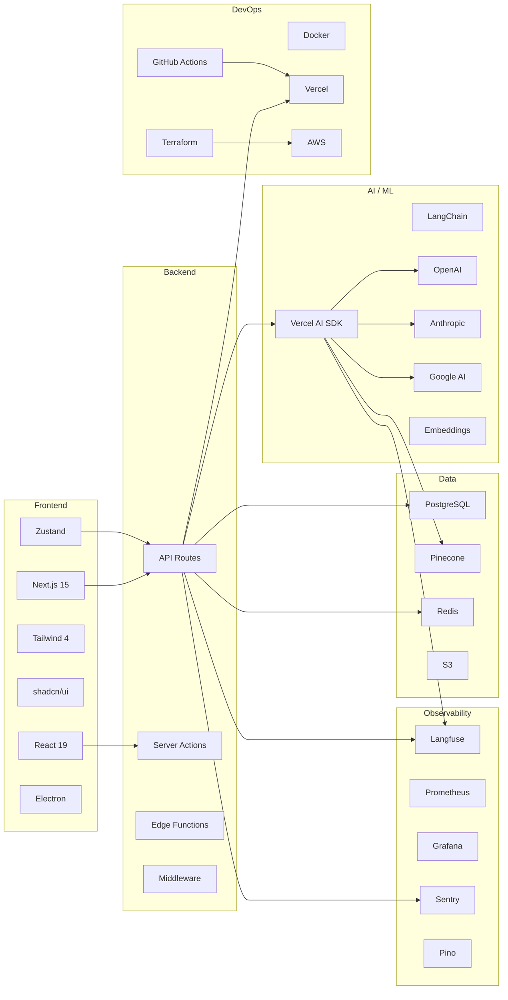

---

## 4. Tous les services du projet

### 4.1 API Gateway

| Attribut | Détail |
|----------|--------|
| **Rôle** | Point d'entrée unique, routing, transformation, sécurité |
| **Responsabilités** | Authentification, rate limiting, request validation, logging, circuit breaker |
| **Endpoints** | `/api/*` — toutes les routes API Next.js |
| **Technologies** | Next.js API Routes, Edge Runtime, Arcjet |
| **Dépendances** | Auth Service, Rate Limiter, Logger |
| **Scaling** | Horizontal via Vercel Edge, auto-scale |
| **Sécurité** | JWT validation, CORS, CSP, input sanitization |
| **Monitoring** | Latence P99, taux d'erreur, throughput |
| **Retry Policy** | Idempotent: 3 retries avec backoff exponentiel |
| **Logs** | Pino structured JSON, correlation ID |
| **Métriques** | requests/sec, latency_histogram, error_rate |

### 4.2 Auth Service

| Attribut | Détail |
|----------|--------|
| **Rôle** | Gestion complète du cycle de vie utilisateur |
| **Responsabilités** | Inscription, connexion, MFA, sessions, tokens, RBAC, audit |
| **Endpoints** | `/auth/signup`, `/auth/login`, `/auth/refresh`, `/auth/mfa`, `/auth/oauth/:provider` |
| **Flux de données** | Credential → Hash (Argon2) → JWT (RS256) + Refresh Token → Session Redis |
| **Technologies** | Supabase Auth, bcrypt/Argon2, jose (JWT) |
| **Dépendances** | PostgreSQL (users), Redis (sessions), Email Service |
| **Scaling** | Stateless, scale horizontal |
| **Sécurité** | Password hashing, JWT expiry, refresh rotation, brute force protection |
| **Monitoring** | Failed login attempts, token refresh rate, MFA adoption |
| **Retry Policy** | Email: 5 retries avec jitter |
| **Logs** | Audit trail immuable (who, what, when, where) |
| **Métriques** | auth_success_rate, session_count, mfa_enabled_ratio |

### 4.3 User Service

| Attribut | Détail |
|----------|--------|
| **Rôle** | Gestion des profils, préférences, organisations |
| **Responsabilités** | CRUD utilisateur, profils, organisations, invitations, quotas |
| **Endpoints** | `/users`, `/users/:id`, `/users/:id/preferences`, `/organizations`, `/invitations` |
| **Flux de données** | Request → Validation Zod → RLS Policy → PostgreSQL → Cache Redis |
| **Technologies** | Supabase Client, Zod, PostgreSQL RLS |
| **Dépendances** | PostgreSQL, Redis, Auth Service |
| **Scaling** | Read replicas, cache hit ratio cible >90% |
| **Sécurité** | Row-Level Security, field-level encryption (PII) |
| **Monitoring** | Profile update latency, org member count distribution |
| **Retry Policy** | Database: 3 retries avec circuit breaker |
| **Logs** | Changes audit (GDPR compliant) |
| **Métriques** | active_users, org_growth_rate, preference_sync_latency |

### 4.4 Billing Service

| Attribut | Détail |
|----------|--------|
| **Rôle** | Gestion des paiements, abonnements, usage-based billing |
| **Responsabilités** | Subscriptions, invoices, usage tracking, webhooks, prorations |
| **Endpoints** | `/billing/subscribe`, `/billing/portal`, `/billing/usage`, `/billing/invoices` |
| **Flux de données** | Stripe Webhook → Signature verify → Idempotency check → DB update → Notification |
| **Technologies** | Stripe SDK, BullMQ workers, PostgreSQL |
| **Dépendances** | Stripe API, PostgreSQL, Redis Queue, Notification Service |
| **Scaling** | Webhook workers horizontaux, idempotency keys |
| **Sécurité** | Webhook signature validation, idempotency, PCI DSS (Stripe handles) |
| **Monitoring** | Revenue MRR, churn rate, webhook delivery rate |
| **Retry Policy** | Stripe API: 3 retries, webhook processing: 5 retries |
| **Logs** | Financial audit trail, immutable |
| **Métriques** | mrr, arpu, churn_rate, invoice_generation_latency |

### 4.5 AI Orchestrator

| Attribut | Détail |
|----------|--------|
| **Rôle** | Cerveau central de dispatch et coordination IA |
| **Responsabilités** | Intent classification, agent selection, context assembly, LLM routing, streaming, error recovery |
| **Endpoints** | `/api/chat`, `/api/agents/:id/invoke`, `/api/workflows/:id/run` |
| **Flux de données** | Input → Intent Classifier → Agent Selector → Context Builder → LLM Router → Stream Manager → Output |
| **Technologies** | Vercel AI SDK, Custom Router, Zustand (orchestration state) |
| **Dépendances** | All agents, Memory Service, LLM Providers, Prompt Engine |
| **Scaling** | Stateful sessions (Redis), stateless workers (horizontal) |
| **Sécurité** | Input validation, prompt injection detection, output filtering |
| **Monitoring** | Intent accuracy, routing latency, LLM cost per request |
| **Retry Policy** | LLM: 3 retries avec fallback model, circuit breaker après 5 erreurs |
| **Logs** | Full request trace, decision tree, token usage |
| **Métriques** | orchestration_latency, intent_accuracy, llm_cost_per_request, fallback_rate |

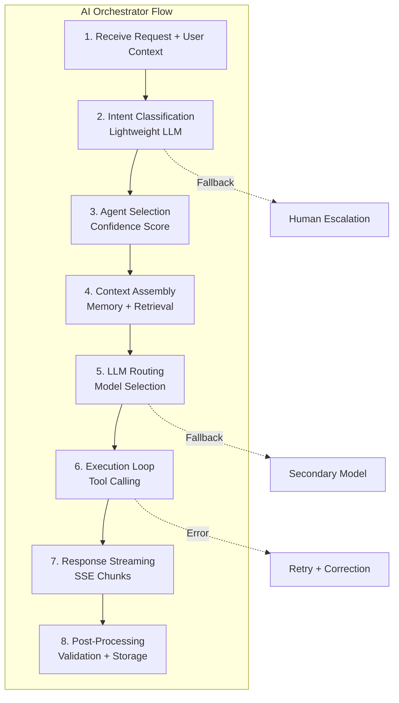

### 4.6 Agent Runtime

| Attribut | Détail |
|----------|--------|
| **Rôle** | Environnement d'exécution isolé pour chaque agent |
| **Responsabilités** | Lifecycle agent, sandboxing, tool execution, memory access, streaming |
| **Endpoints** | Interne (orchestrator → runtime) |
| **Flux de données** | Agent Config → Sandbox init → Tool registry → Execute → Stream → Cleanup |
| **Technologies** | Node.js VM2 / isolated-vm, Docker (future) |
| **Dépendances** | Tool Registry, Memory Service, LLM Providers |
| **Scaling** | Container-based, resource limits per agent |
| **Sécurité** | Sandboxing, network isolation, resource quotas, timeout enforcement |
| **Monitoring** | Agent execution time, memory usage, tool call frequency |
| **Retry Policy** | Tool: 3 retries, Agent: 1 retry puis escalation |
| **Logs** | Execution trace, tool inputs/outputs |
| **Métriques** | agent_execution_time, tool_success_rate, sandbox_memory_peak |

### 4.7 Prompt Engine

| Attribut | Détail |
|----------|--------|
| **Rôle** | Gestion centralisée des prompts versionnés et optimisés |
| **Responsabilités** | Template rendering, version control, A/B testing, prompt optimization |
| **Endpoints** | `/api/prompts`, `/api/prompts/:id/versions`, `/api/prompts/:id/evaluate` |
| **Flux de données** | Template ID + Variables → Render → Version check → Optimize → Return |
| **Technologies** | Handlebars / Custom DSL, Langfuse Prompt Management |
| **Dépendances** | Database (prompts), Cache, Evaluation Service |
| **Scaling** | Cache-first, read-heavy |
| **Sécurité** | Input escaping, template injection prevention |
| **Monitoring** | Prompt render latency, version distribution, A/B test significance |
| **Retry Policy** | Cache miss: fallback to DB |
| **Logs** | Prompt version used, render errors |
| **Métriques** | prompt_render_latency, cache_hit_ratio, ab_test_conversion |

### 4.8 Memory Service

| Attribut | Détail |
|----------|--------|
| **Rôle** | Gestion unifiée de toutes les formes de mémoire |
| **Responsabilités** | Short-term, long-term, episodic, semantic, vector storage, retrieval, fusion |
| **Endpoints** | `/api/memory/save`, `/api/memory/recall`, `/api/memory/search`, `/api/memory/merge` |
| **Flux de données** | Input → Type detection → Storage strategy → Index → Retrieve → Fusion → Return |
| **Technologies** | PostgreSQL, Pinecone, Redis, Custom fusion algorithms |
| **Dépendances** | PostgreSQL, Pinecone, Redis, Embedding Service |
| **Scaling** | Vector DB: shard by user, PostgreSQL: read replicas |
| **Sécurité** | Encryption at rest, user isolation, access control |
| **Monitoring** | Retrieval latency, memory hit rate, vector count |
| **Retry Policy** | Vector DB: 3 retries, fallback to semantic cache |
| **Logs** | Memory operations, fusion decisions |
| **Métriques** | memory_retrieval_latency, vector_count, memory_hit_rate, fusion_accuracy |

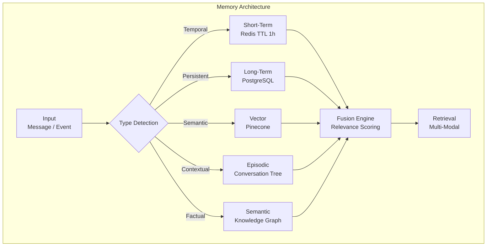

### 4.9 Embedding Service

| Attribut | Détail |
|----------|--------|
| **Rôle** | Génération et gestion des embeddings vectoriels |
| **Responsabilités** | Text embedding, batch processing, dimension reduction, model management |
| **Endpoints** | `/api/embeddings`, `/api/embeddings/batch`, `/api/embeddings/similarity` |
| **Flux de données** | Text → Chunk → Embed (OpenAI) → Store (Pinecone) → Index |
| **Technologies** | OpenAI Embedding API, Pinecone, BullMQ |
| **Dépendances** | OpenAI API, Pinecone, Redis Queue |
| **Scaling** | Async workers, batch processing (100 docs/batch) |
| **Sécurité** | Data anonymization before embedding, PII redaction |
| **Monitoring** | Embedding latency, queue depth, token usage |
| **Retry Policy** | OpenAI: 3 retries avec backoff, DLQ après échec |
| **Logs** | Batch processing logs, model version |
| **Métriques** | embedding_latency, tokens_per_second, queue_depth, batch_size_avg |

### 4.10 Retrieval Service

| Attribut | Détail |
|----------|--------|
| **Rôle** | Recherche et récupération intelligente de contexte |
| **Responsabilités** | Hybrid search, reranking, context assembly, citation tracking |
| **Endpoints** | `/api/retrieve`, `/api/retrieve/hybrid`, `/api/retrieve/citations` |
| **Flux de données** | Query → Embed → Vector search → Keyword search → Rerank → Assemble → Cite |
| **Technologies** | Pinecone hybrid search, Cohere rerank (optional), Custom assembly |
| **Dépendances** | Pinecone, Embedding Service, Memory Service |
| **Scaling** | Parallel search, result caching |
| **Sécurité** | Filter by user_id, document ACL |
| **Monitoring** | Retrieval latency, precision@k, MRR |
| **Retry Policy** | Search: 2 retries, Rerank: 1 retry |
| **Logs** | Search queries, results count, relevance scores |
| **Métriques** | retrieval_latency, precision_at_k, mrr, result_count_avg |

### 4.11 Vector Database

| Attribut | Détail |
|----------|--------|
| **Rôle** | Stockage et recherche vectorielle haute performance |
| **Responsabilités** | Indexation, ANN search, metadata filtering, hybrid queries |
| **Endpoints** | Interne (Pinecone SDK) |
| **Flux de données** | Vectors + Metadata → Upsert → Index → Query → ANN → Return |
| **Technologies** | Pinecone Serverless |
| **Dépendances** | Pinecone Cloud, Embedding Service |
| **Scaling** | Auto-scaling pods, serverless pour variable load |
| **Sécurité** | API key rotation, network isolation, encryption |
| **Monitoring** | Query latency, index size, pod utilization |
| **Retry Policy** | SDK built-in: 3 retries |
| **Logs** | Query logs, index operations |
| **Métriques** | query_latency_p99, index_size_bytes, pod_cpu_utilization |

### 4.12 Workflow Engine

| Attribut | Détail |
|----------|--------|
| **Rôle** | Orchestration de workflows multi-étapes et multi-agents |
| **Responsabilités** | DAG execution, conditional branching, parallel execution, state management |
| **Endpoints** | `/api/workflows`, `/api/workflows/:id/execute`, `/api/workflows/:id/status` |
| **Flux de données** | Workflow Def → Parse DAG → Schedule nodes → Execute → Monitor → Complete |
| **Technologies** | Custom DAG engine, BullMQ for scheduling, PostgreSQL for state |
| **Dépendances** | PostgreSQL, Redis, All agent services |
| **Scaling** | Worker pools par type de nœud |
| **Sécurité** | Workflow sandbox, resource limits, timeout |
| **Monitoring** | Execution time per node, failure rate, DAG complexity |
| **Retry Policy** | Node: 3 retries, Workflow: configurable |
| **Logs** | Execution trace, node inputs/outputs |
| **Métriques** | workflow_execution_time, node_failure_rate, dag_depth_avg |

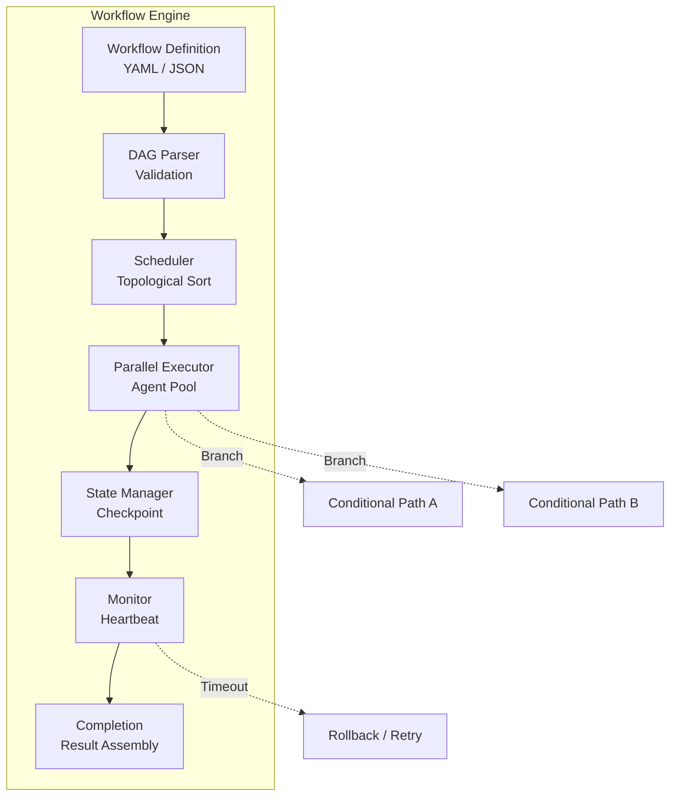

### 4.13 Notification Service

| Attribut | Détail |
|----------|--------|
| **Rôle** | Distribution multi-canal des notifications |
| **Responsabilités** | Email, push, in-app, SMS, Slack, webhook dispatch |
| **Endpoints** | `/api/notifications`, `/api/notifications/preferences`, `/api/notifications/webhooks` |
| **Flux de données** | Event → Channel selection → Template render → Queue → Dispatch → Track |
| **Technologies** | Resend (email), Firebase (push), Twilio (SMS), Slack SDK |
| **Dépendances** | Redis Queue, Template engine, External APIs |
| **Scaling** | Workers par canal, rate limiting par provider |
| **Sécurité** | Webhook signature, unsubscribe, PII handling |
| **Monitoring** | Delivery rate, open rate, bounce rate |
| **Retry Policy** | Email: 5 retries, Push: 3 retries, SMS: 3 retries |
| **Logs** | Delivery attempts, bounces, unsubscribes |
| **Métriques** | delivery_rate, open_rate, bounce_rate, latency_per_channel |

### 4.14 Analytics Service

| Attribut | Détail |
|----------|--------|
| **Rôle** | Collecte, agrégation et analyse des données produit |
| **Responsabilités** | Event tracking, funnel analysis, retention, LLM usage analytics |
| **Endpoints** | `/api/analytics/events`, `/api/analytics/dashboard`, `/api/analytics/llm-usage` |
| **Flux de données** | Events → Kafka/Redis Stream → Batch processing → Data warehouse → Dashboard |
| **Technologies** | Segment / Custom, Clickhouse / BigQuery, Grafana |
| **Dépendances** | Message queue, Data warehouse, Visualization |
| **Scaling** | Stream processing, batch aggregation |
| **Sécurité** | Anonymization, GDPR compliance, data retention |
| **Monitoring** | Pipeline lag, event loss rate, query performance |
| **Retry Policy** | Event delivery: at-least-once semantics |
| **Logs** | Pipeline operations, schema evolution |
| **Métriques** | events_per_second, pipeline_lag, query_latency, data_freshness |

### 4.15 Admin Service

| Attribut | Détail |
|----------|--------|
| **Rôle** | Interface d'administration et gestion système |
| **Responsabilités** | User management, system config, prompt management, audit logs, feature flags |
| **Endpoints** | `/admin/*`, `/api/admin/users`, `/api/admin/prompts`, `/api/admin/audit` |
| **Flux de données** | Admin request → RBAC check → Operation → Audit log → Response |
| **Technologies** | Next.js Admin Panel, RBAC middleware, Audit logger |
| **Dépendances** | All services, Auth Service, Audit DB |
| **Scaling** | Low traffic, internal use |
| **Sécurité** | MFA obligatoire, IP whitelist, audit immuable |
| **Monitoring** | Admin actions, unauthorized attempts |
| **Retry Policy** | Standard: 3 retries |
| **Logs** | All admin actions, immutable audit trail |
| **Métriques** | admin_actions_per_day, unauthorized_attempts, audit_log_size |

### 4.16 File Processing Service

| Attribut | Détail |
|----------|--------|
| **Rôle** | Ingestion, transformation et extraction de documents |
| **Responsabilités** | Upload, OCR, parsing, chunking, metadata extraction, virus scan |
| **Endpoints** | `/api/files/upload`, `/api/files/:id/process`, `/api/files/:id/extract` |
| **Flux de données** | Upload → Virus scan → Parse → Chunk → Embed → Index → Notify |
| **Technologies** | Multer, ClamAV, pdf-parse, Tesseract, LangChain document loaders |
| **Dépendances** | S3, Embedding Service, Virus scanner, Queue |
| **Scaling** | Async workers, horizontal scaling |
| **Sécurité** | Virus scan, file type validation, size limits, sandboxed parsing |
| **Monitoring** | Processing time, success rate, queue depth |
| **Retry Policy** | Processing: 3 retries, DLQ for failures |
| **Logs** | Processing pipeline, extraction results |
| **Métriques** | processing_time, success_rate, queue_depth, file_size_avg |

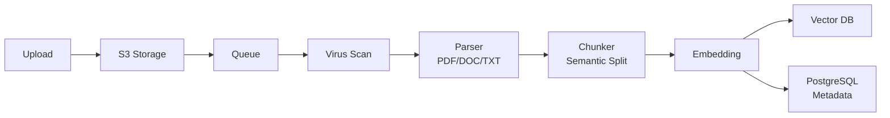

### 4.17 Realtime Service

| Attribut | Détail |
|----------|--------|
| **Rôle** | Communication temps réel bidirectionnelle |
| **Responsabilités** | WebSocket management, rooms, presence, typing indicators, live updates |
| **Endpoints** | `wss://api.hearst.io/socket` |
| **Flux de données** | Connect → Authenticate → Join room → Broadcast → Presence tracking |
| **Technologies** | Socket.io, Redis Adapter (multi-server) |
| **Dépendances** | Redis (pub/sub), Auth Service |
| **Scaling** | Horizontal avec Redis adapter, sticky sessions |
| **Sécurité** | JWT auth on connect, room ACL, rate limiting |
| **Monitoring** | Connection count, message throughput, latency |
| **Retry Policy** | Auto-reconnect client, heartbeat detection |
| **Logs** | Connection events, room joins, errors |
| **Métriques** | connections_active, messages_per_second, reconnect_rate, latency_ms |

### 4.18 Observability Stack

| Attribut | Détail |
|----------|--------|
| **Rôle** | Monitoring complet du système distribué |
| **Responsabilités** | Logs, metrics, traces, alerting, dashboards, LLM observability |
| **Endpoints** | Interne, dashboards publics |
| **Flux de données** | Instrumentation → Collectors → Storage → Visualization → Alerting |
| **Technologies** | Langfuse, Prometheus, Grafana, Pino, Sentry, OpenTelemetry |
| **Dépendances** | All services (instrumentation) |
| **Scaling** | Centralized collectors, long-term storage |
| **Sécurité** | Log redaction, access control, data retention |
| **Monitoring** | Self-monitoring, collector health |
| **Retry Policy** | Buffer and retry, at-least-once delivery |
| **Logs** | System health, alert history |
| **Métriques** | collector_lag, storage_utilization, alert_noise_ratio |

---

## 5. Architecture des agents IA

### 5.1 Fonctionnement des agents

Un **agent IA** dans Hearst OS est une entité autonome capable de :
- **Percevoir** son environnement (inputs utilisateur, contexte, mémoire)
- **Raisonner** sur les objectifs (planification, décomposition)
- **Agir** via des outils (APIs, fonctions, calculs)
- **Apprendre** de ses interactions (feedback, mémoire)

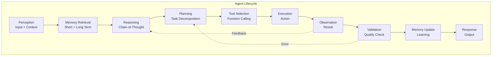

### 5.2 Orchestrateur

L'orchestrateur est le **cerveau central** qui coordonne tous les agents. Il implémente plusieurs patterns :

| Pattern | Description | Use Case |
|---------|-------------|----------|
| **Router** | Sélectionne l'agent le plus pertinent | Intent classification |
| **Chainer** | Enchaîne séquentiellement plusieurs agents | Workflows complexes |
| **Parallel** | Exécute plusieurs agents en parallèle | Analyse multi-dimensionnelle |
| **Evaluator-Optimizer** | Boucle d'amélioration itérative | Génération de code, rédaction |
| **Orchestrator-Workers** | Un agent décompose, des workers exécutent | Recherche approfondie |
| **Aggregator** | Fusionne les résultats de plusieurs agents | Synthèse de rapports |

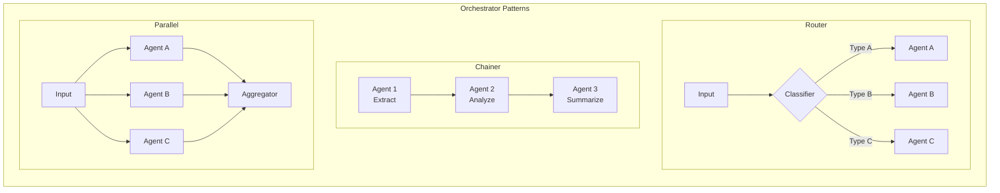

### 5.3 Multi-Agent System

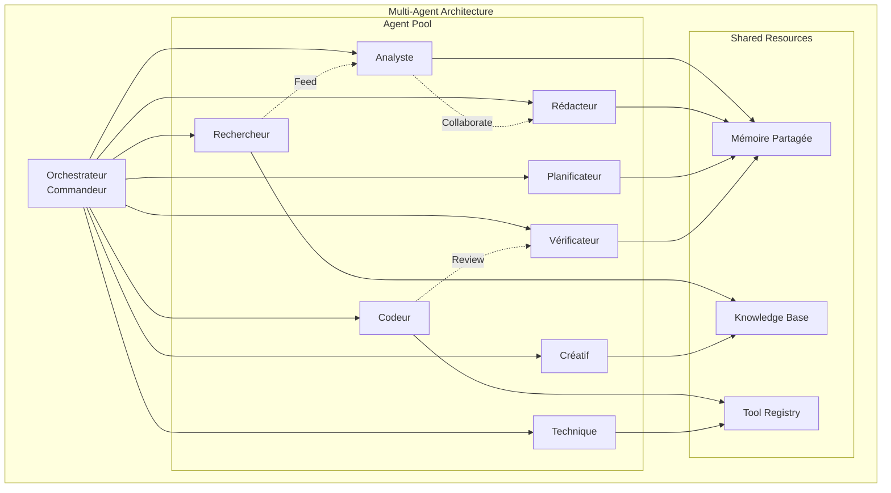

### 5.4 Communication inter-agents

Les agents communiquent via un **protocole standardisé** :

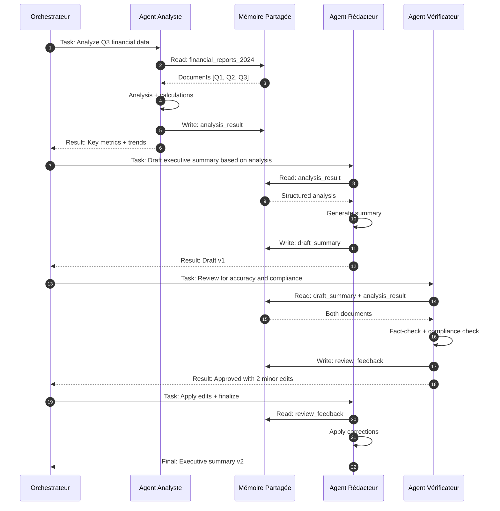

### 5.5 Tool Calling

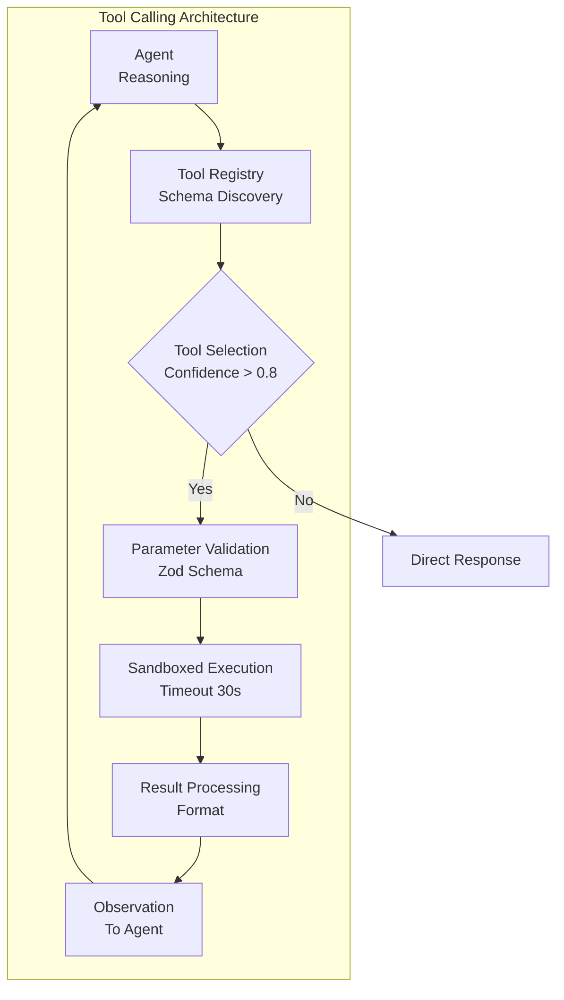

### 5.6 Mémoire — Architecture complète

| Type | Stockage | Durée | Capacité | Use Case |
|------|----------|-------|----------|----------|
| **Ultra-court terme** | Contexte LLM | 1 requête | 128K tokens | Contexte immédiat |
| **Court terme** | Redis | 1-24h | Sessions actives | Conversations en cours |
| **Long terme** | PostgreSQL | Permanent | Illimité | Profils, préférences |
| **Vectorielle** | Pinecone | Permanent | Millions | Recherche sémantique |
| **Épisodique** | PostgreSQL + Tree | Permanent | Conversations | Historique chat |
| **Sémantique** | Knowledge Graph | Permanent | Entités + Relations | Faits métier |

### 5.7 Reasoning & Planning

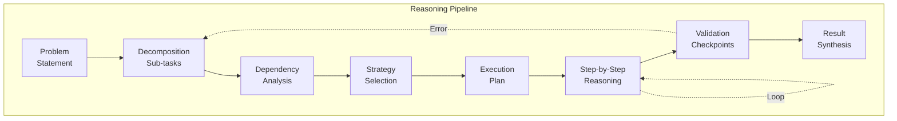

### 5.8 Execution Loop

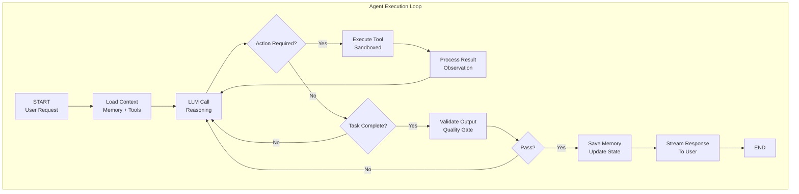

### 5.9 Validation & Auto-correction

| Couche | Mécanisme | Déclencheur | Action |
|--------|-----------|-------------|--------|
| **Syntaxique** | JSON Schema, Zod | Format invalide | Retry avec correction |
| **Sémantique** | LLM Judge | Incohérence | Regenerate + explanation |
| **Factual** | RAG verification | Hallucination detected | Retrieve + correct |
| **Sécurité** | Guardrails | Toxicity / PII | Block + log + alert |
| **Qualité** | Custom metrics | Score < threshold | Iterative refinement |
| **Humain** | Escalation | Critical failure | Human-in-the-loop |

### 5.10 Guardrails

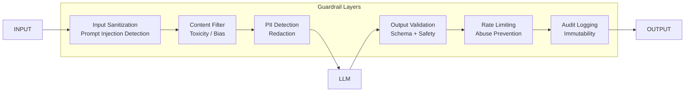

### 5.11 Fallback Models & Routing Intelligent

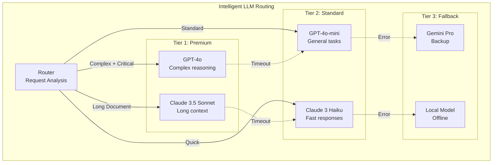

---

## 6. Explication détaillée des LLM utilisés

### 6.1 Tableau comparatif complet

| Modèle | Rôle | Pourquoi | Coût (input) | Coût (output) | Vitesse | Contexte | Température | Limites | Fallback |
|--------|------|----------|--------------|---------------|---------|----------|-------------|---------|----------|
| **GPT-4o** | Raisonnement complexe, analyse | Meilleur raisonnement multi-étapes, tool calling fiable | $2.50/M | $10.00/M | Moyenne | 128K | 0.3-0.7 | Coût élevé, rate limits | Claude 3.5 Sonnet |
| **GPT-4o-mini** | Tâches générales, chat | Excellent rapport qualité/prix, latence faible | $0.15/M | $0.60/M | Rapide | 128K | 0.5-0.8 | Moins puissant pour le raisonnement | GPT-4o |
| **Claude 3.5 Sonnet** | Long contexte, analyse document | 200K contexte, excellente compréhension | $3.00/M | $15.00/M | Moyenne | 200K | 0.2-0.5 | Plus lent, coût élevé | GPT-4o |
| **Claude 3 Haiku** | Réponses rapides, chat simple | Latence très faible, coût minimal | $0.25/M | $1.25/M | Très rapide | 200K | 0.5-0.9 | Capacités limitées | GPT-4o-mini |
| **Gemini 1.5 Pro** | Multimodal, long contexte | 1M tokens, natif multimodal | $3.50/M | $10.50/M | Moyenne | 1M | 0.3-0.6 | Disponibilité variable | Claude 3.5 Sonnet |
| **Gemini 1.5 Flash** | Tâches rapides, multimodal | Rapide, multimodal, bon marché | $0.35/M | $1.05/M | Rapide | 1M | 0.5-0.8 | Moins précis | Gemini 1.5 Pro |
| **Llama 3.1 70B** | Offline, confidentialité | Open source, hébergement privé | $0 (self-hosted) | $0 | Variable | 128K | 0.3-0.7 | Infra requise, moins performant | API cloud |
| **Mistral Large** | Code, raisonnement | Excellent en code, européen | $2.00/M | $6.00/M | Rapide | 128K | 0.2-0.5 | Moins connu | GPT-4o |

### 6.2 Stratégie de routing

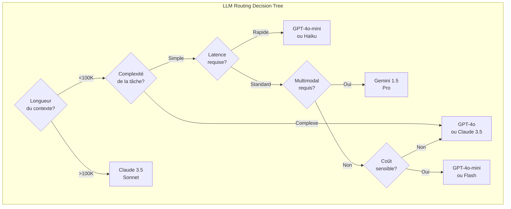

### 6.3 Paramètres et optimisation

| Paramètre | GPT-4o | Claude 3.5 | Gemini 1.5 | Llama 3.1 |
|-----------|--------|------------|------------|-----------|
| **Temperature** | 0.3 (analyse) / 0.7 (créatif) | 0.2 (analyse) / 0.5 (créatif) | 0.3 / 0.6 | 0.3 / 0.7 |
| **Top-p** | 0.9 | 0.9 | 0.95 | 0.9 |
| **Max tokens** | 4096 (standard) / 16K (extended) | 4096 / 8192 | 8192 | 4096 |
| **Presence penalty** | 0.1 | N/A | 0.0 | 0.1 |
| **Frequency penalty** | 0.1 | N/A | 0.0 | 0.1 |
| **Stop sequences** | Custom | Custom | Custom | Custom |
| **Seed** | Fixed (reproductibilité) | N/A | Fixed | Fixed |
| **JSON mode** | Oui | Oui | Oui | Oui |
| **Tool calling** | Native | Native | Native | Function calling |

---

## 7. APIs externes utilisées

### 7.1 Tableau détaillé des APIs

| API | Rôle | Endpoints utilisés | Auth | Limites | Pricing | Retry | Sécurité | Données échangées |
|-----|------|-------------------|------|---------|---------|-------|----------|-------------------|
| **OpenAI** | LLM, Embeddings | `/v1/chat/completions`, `/v1/embeddings` | Bearer Token (API Key) | 10K RPM (Tier 5) | $2.50/M input, $10/M output | 3 retries, backoff exponentiel | API key rotation, IP whitelist | Prompts, completions, embeddings |
| **Anthropic** | LLM | `/v1/messages` | x-api-key header | 4K RPM | $3/M input, $15/M output | 3 retries, circuit breaker | Key rotation, request signing | Messages, system prompts |
| **Google AI** | LLM, Multimodal | `/v1beta/models/:model:generateContent` | API Key | Variable | $3.50/M input, $10.50/M output | 3 retries | Key management | Text, images, documents |
| **Pinecone** | Vector DB | `/query`, `/upsert`, `/delete` | API Key | 100 RPS | $0.10/GB/mois + $0.096/hour | SDK built-in 3 retries | TLS, API key, VPC | Vectors, metadata, IDs |
| **Stripe** | Paiements | `/v1/customers`, `/v1/subscriptions`, `/v1/invoices`, webhooks | Secret key + Webhook secret | Variable | 2.9% + $0.30 / transaction | Webhook: idempotent, API: 3 retries | Webhook signature, TLS | Paiements, subscriptions, invoices |
| **Slack** | Notifications | `/chat.postMessage`, `/conversations.open` | Bot Token (OAuth) | 1+ TPS | Gratuit (limites) | 3 retries, rate limit respect | OAuth 2.0, scopes | Messages, channels, users |
| **Gmail API** | Email | `/gmail/v1/users/me/messages`, `/send` | OAuth 2.0 | 1B quota units/jour | Gratuit (limites) | Exponential backoff | OAuth, refresh tokens | Emails, drafts, labels |
| **Google Calendar** | Calendar | `/calendar/v3/calendars`, `/events` | OAuth 2.0 | 1M requêtes/jour | Gratuit | Exponential backoff | OAuth, scopes | Events, calendars, attendees |
| **Twilio** | SMS | `/Messages`, `/Calls` | Basic Auth (SID + Token) | Variable | $0.0075/SMS | 3 retries | TLS, webhook signature | SMS, calls, media |
| **AWS S3** | Stockage | `PutObject`, `GetObject`, `DeleteObject` | IAM + Signature V4 | 3.5K PUT/s, 5.5K GET/s | $0.023/GB/mois | SDK built-in | IAM policies, encryption | Fichiers, métadonnées |
| **Redis Cloud** | Cache | Redis protocol | AUTH + TLS | Variable par plan | $5-500/mois | Client reconnect | TLS, VPC peering | Sessions, cache, queues |
| **Langfuse** | Observability | `/api/public/traces`, `/api/public/scores` | Public Key + Secret Key | Variable | Cloud: $0-500/mois | 3 retries | API keys, TLS | Traces, scores, prompts |
| **Resend** | Email | `/emails`, `/domains` | Bearer Token | 100 emails/jour (free) | $0.0009/email | 5 retries | DKIM, SPF, DMARC | Emails, templates |
| **Supabase** | Database, Auth | REST + Realtime | JWT (anon/service) | Variable | $0-25/GB/mois | Client retry | RLS, TLS, MFA | Users, data, realtime |
| **Vercel** | Hosting | Deployments, Edge | Token | Variable | $0-20/mois | N/A | Team access, SSO | Code, config, logs |

### 7.2 Architecture d'intégration APIs

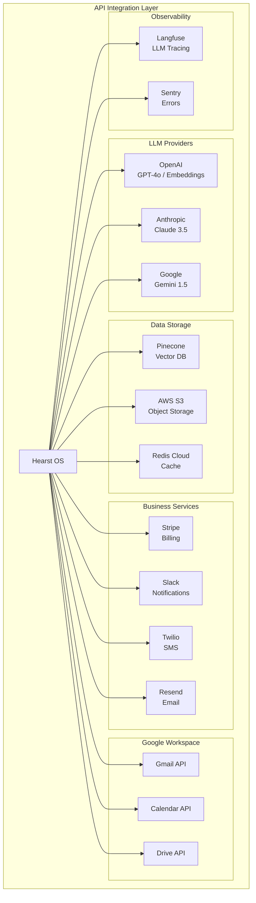

---

## 8. Flux de données complet

### 8.1 Cycle complet d'une requête utilisateur

```mermaid
graph TB
    subgraph "Complete Data Flow"
        direction TB
        
        F1["1. User Input<br/>Text / Voice / File"]
        F2["2. Client Validation<br/>Zod Schema"]
        F3["3. Auth Check<br/>JWT + RBAC"]
        F4["4. Rate Limit<br/>Token Bucket"]
        F5["5. Input Processing<br/>Sanitization"]
        F6["6. Intent Classification<br/>Lightweight LLM"]
        F7["7. Memory Retrieval<br/>Short + Long Term"]
        F8["8. Vector Search<br/>Semantic Retrieval"]
        F9["9. Context Assembly<br/>Fusion"]
        F10["10. Agent Selection<br/>Router"]
        F11["11. Prompt Construction<br/>Template + Context"]
        F12["12. LLM Routing<br/>Model Selection"]
        F13["13. Generation<br/>Streaming"]
        F14["14. Tool Calling<br/>If Needed"]
        F15["15. Validation<br/>Quality Gate"]
        F16["16. Response Streaming<br/>SSE"]
        F17["17. Memory Update<br/>Save Exchange"]
        F18["18. Analytics<br/>Event Tracking"]
        F19["19. Post-Processing<br/>Formatting"]
        F20["20. Client Render<br/>UI Update"]
    end

    F1 --> F2 --> F3 --> F4 --> F5 --> F6 --> F7 --> F8 --> F9 --> F10 --> F11 --> F12 --> F13 --> F15 --> F16 --> F17 --> F18 --> F19 --> F20
    F13 -.->|Tool Required| F14 --> F13
    F15 -.->|Fail| F13
```

### 8.2 Diagramme de séquence détaillé

```mermaid
sequenceDiagram
    autonumber
    actor U as Utilisateur
    participant C as Client Next.js
    participant G as API Gateway
    participant A as Auth Service
    participant O as AI Orchestrator
    participant I as Intent Classifier
    participant M as Memory Service
    participant V as Vector DB
    participant P as Prompt Engine
    participant L as LLM Provider
    participant T as Tool Registry
    participant Q as Worker Queue
    participant S as Analytics

    U->>C: "Analyse les ventes Q3"
    C->>C: Zod validation
    C->>G: POST /api/chat<br/>{message, sessionId}<br/>Authorization: Bearer jwt
    
    G->>A: validateToken(jwt)
    A-->>G: {userId, orgId, roles, quota}
    
    G->>G: checkRateLimit(userId)
    G->>G: sanitizeInput(message)
    
    G->>O: process(message, context)
    
    par Parallel Operations
        O->>M: getShortTermMemory(sessionId)
        M-->>O: [last 10 messages]
        
        O->>M: getLongTermMemory(userId)
        M-->>O: {preferences, facts}
        
        O->>V: semanticSearch("ventes Q3")
        V-->>O: [doc1, doc2, doc3]
    end
    
    O->>I: classifyIntent(message + context)
    I-->>O: {intent: "financial_analysis", confidence: 0.94, agent: "analyste"}
    
    O->>P: buildPrompt(agent="analyste", context, retrieved_docs)
    P-->>O: system_prompt + user_message + context_injection
    
    O->>O: selectModel(intent, complexity, context_length)
    
    O->>L: generate(system_prompt, user_message, stream=true)
    
    loop Streaming
        L-->>O: chunk
        O-->>G: chunk
        G-->>C: SSE: data: {chunk}
        C-->>U: Affichage progressif
    end
    
    alt Tool Required
        O->>T: executeTool("fetch_sales_data", {quarter: "Q3"})
        T-->>O: {revenue: 1.2M, growth: 15%}
        O->>L: generate(continuation + tool_result)
        L-->>O: final_response
    end
    
    O->>O: validateOutput(response)
    
    par Async Post-Processing
        O->>M: saveMessage(userId, sessionId, message, response)
        O->>Q: enqueue("embed_message", {text: message})
        O->>Q: enqueue("analytics_event", {type: "chat", agent: "analyste"})
        O->>S: trackEvent("llm_request", {model, tokens, cost})
    end
    
    O-->>G: stream end
    G-->>C: SSE: data: [DONE]
    C-->>U: Réponse complète affichée
```

---

## 9. Pipeline RAG complet

### 9.1 Architecture RAG

```mermaid
graph TB
    subgraph "RAG Pipeline"
        direction TB
        
        subgraph "Ingestion"
            I1["Document<br/>Upload"]
            I2["Format Detection<br/>PDF/DOC/TXT/MD"]
            I3["Text Extraction<br/>OCR if needed"]
            I4["Cleaning<br/>Normalize + Strip"]
        end
        
        subgraph "Chunking"
            C1["Semantic Chunking<br/>Recursive Split"]
            C2["Overlap<br/>20% context window"]
            C3["Metadata Extraction<br/>Title, Source, Date"]
            C4["Chunk Validation<br/>Min/Max size"]
        end
        
        subgraph "Embedding"
            E1["Batch Preparation<br/>100 chunks"]
            E2["OpenAI Embedding<br/>text-embedding-3-large"]
            E3["Dimension<br/>3072"]
            E4["Normalization<br/>L2"]
        end
        
        subgraph "Indexing"
            IX1["Pinecone Upsert<br/>Batches"]
            IX2["Metadata Indexing<br/>Filterable"]
            IX3["ID Mapping<br/>Document ↔ Chunks"]
        end
        
        subgraph "Retrieval"
            R1["Query Embedding<br/>Same model"]
            R2["Vector Search<br/>Top-K = 10"]
            R3["Metadata Filter<br/>User ACL"]
            R4["Hybrid Search<br/>BM25 + Vector"]
        end
        
        subgraph "Reranking"
            RR1["Cross-Encoder<br/>Relevance Score"]
            RR2["Deduplication<br/>Semantic + Exact"]
            RR3["Top-N Selection<br/>N = 5"]
        end
        
        subgraph "Context Injection"
            CI1["Citation Tracking<br/>Source + Page"]
            CI2["Context Assembly<br/>Ordered by relevance"]
            CI3["Token Budget<br/>Max 4000 tokens"]
            CI4["Prompt Injection<br/>System message"]
        end
        
        subgraph "Generation"
            G1["LLM with Context<br/>RAG-enhanced"]
            G2["Citation Generation<br/>[Source: doc.pdf p.3]"]
            G3["Answer Validation<br/>Grounded check"]
        end
    end

    I1 --> I2 --> I3 --> I4
    I4 --> C1 --> C2 --> C3 --> C4
    C4 --> E1 --> E2 --> E3 --> E4
    E4 --> IX1 --> IX2 --> IX3
    
    IX3 -.->|Query time| R1 --> R2 --> R3 --> R4
    R4 --> RR1 --> RR2 --> RR3
    RR3 --> CI1 --> CI2 --> CI3 --> CI4
    CI4 --> G1 --> G2 --> G3
```

### 9.2 Chunking Strategy

| Stratégie | Méthode | Taille | Overlap | Use Case |
|-----------|---------|--------|---------|----------|
| **Recursive** | Split par séparateurs (\n\n, \n, .) | 512-1024 tokens | 20% | Texte général |
| **Semantic** | Split par phrases cohérentes | 256-512 tokens | 10% | Documents techniques |
| **Fixed** | Taille fixe avec overlap | 512 tokens | 50 tokens | Code, logs |
| **Markdown** | Split par headers | Variable | 0% | Documentation |
| **Parent-Document** | Petit chunk + référence parent | 128 tokens | 0% | Retrieval précis |

### 9.3 Retrieval & Reranking

```mermaid
graph LR
    subgraph "Retrieval Pipeline"
        Q["Query"] --> E["Embed Query"]
        E --> VS["Vector Search<br/>Top 20"]
        E --> KS["Keyword Search<br/>BM25"]
        VS --> F["Fusion<br/>RRF Score"]
        KS --> F
        F --> R["Rerank<br/>Cross-Encoder"]
        R --> D["Deduplicate"]
        D --> S["Select Top 5"]
        S --> C["Context Assembly"]
    end
```

---

## 10. Formation et amélioration des agents

### 10.1 Pipeline d'amélioration continue

```mermaid
graph TB
    subgraph "Continuous Improvement Loop"
        CP1["Collect Interactions<br/>Logs + Feedback"]
        CP2["Filter Quality Data<br/>Score > threshold"]
        CP3["Human Review<br/>Annotation"]
        CP4["Synthetic Data<br/>Augmentation"]
        CP5["Evaluation Dataset<br/>Benchmark"]
        CP6["Prompt A/B Testing<br/>Performance"]
        CP7["Fine-tuning<br/>If needed"]
        CP8["Deployment<br/>Canary"]
        CP9["Monitor<br/>Regression"]
    end

    CP1 --> CP2 --> CP3 --> CP4 --> CP5 --> CP6 --> CP7 --> CP8 --> CP9 --> CP1
```

### 10.2 Techniques d'amélioration

| Technique | Description | Fréquence | Impact |
|-----------|-------------|-----------|--------|
| **Prompt Engineering** | Optimisation des templates | Continue | +15-30% qualité |
| **Few-shot Examples** | Exemples dans le contexte | Par agent | +20% accuracy |
| **Chain-of-Thought** | Raisonnement étape par étape | Tâches complexes | +25% reasoning |
| **RLHF** | Reinforcement Learning from Human Feedback | Mensuel | +30% alignment |
| **DPO** | Direct Preference Optimization | Mensuel | +25% preference |
| **Fine-tuning** | Entraînement sur données propriétaires | Trimestriel | +40% domain-specific |
| **Evaluation Pipeline** | Benchmarks automatisés | Continue | Détection régression |
| **Hallucination Detection** | Vérification factuelle | Temps réel | -80% hallucinations |

### 10.3 Évaluation et métriques

```mermaid
graph TB
    subgraph "Evaluation Framework"
        E1["Ground Truth Dataset<br/>1000+ Q&A pairs"]
        E2["Automated Metrics<br/>BLEU, ROUGE, BERTScore"]
        E3["LLM-as-Judge<br/>GPT-4 Evaluation"]
        E4["Human Evaluation<br/>Likert Scale 1-5"]
        E5["A/B Testing<br/>Production"]
        E6["Regression Detection<br/>CI/CD"]
    end

    E1 --> E2 --> E3 --> E4 --> E5 --> E6
```

---

## 11. Prompt engineering system

### 11.1 Architecture des prompts

```mermaid
graph TB
    subgraph "Prompt System Architecture"
        P1["Template Registry<br/>Versioned"]
        P2["Variable Injection<br/>Dynamic"]
        P3["Context Assembly<br/>Memory + RAG"]
        P4["Safety Layer<br/>Guardrails"]
        P5["Model Adapter<br/>Format conversion"]
        P6["A/B Testing<br/>Experimentation"]
        P7["Analytics<br/>Performance tracking"]
    end

    P1 --> P2 --> P3 --> P4 --> P5 --> P6 --> P7
```

### 11.2 Exemples de prompts système

#### Agent Analyste Financier

```
Tu es un analyste financier senior avec 15 ans d'expérience. 
Tu analyses des données financières pour produire des insights actionnables.

RÈGLES:
- Toujours citer tes sources [Source: document, page X]
- Utiliser des chiffres précis, pas d'arrondis sauf demande
- Structurer tes réponses: Résumé → Détails → Recommandations
- Signaler immédiatement toute incohérence dans les données
- Ne pas faire de prédictions sans qualification de confiance

OUTILS DISPONIBLES:
- fetch_financial_data(period, metric)
- calculate_growth(current, previous)
- compare_benchmark(company, sector)

TON: Professionnel, concis, factuel
LANGUE: Français (sauf termes techniques)
```

#### Agent Rédacteur

```
Tu es un rédacteur expert capable de produire du contenu de haute qualité.

RÈGLES:
- Adapter le ton au public cible spécifié
- Structure claire avec titres et sous-titres
- Phrases courtes et directes (< 25 mots)
- Vérifier la cohérence et la fluidité
- Proposer 3 variantes quand demandé

FORMAT DE SORTIE:
- Titre accrocheur
- Introduction (2-3 phrases)
- Corps (points clés)
- Conclusion avec CTA

SAFETY:
- Pas de contenu discriminatoire
- Pas de désinformation
- Respecter les droits d'auteur
```

### 11.3 Prompt de routing intelligent

```
Tu es un routeur intelligent qui classe les requêtes utilisateur.

ANALYSE la requête et détermine:
1. INTENT: [chat | analysis | creation | search | action]
2. AGENT: [commandeur | analyste | redacteur | rechercheur | planificateur]
3. COMPLEXITY: [simple | moderate | complex]
4. URGENCY: [low | normal | high]
5. DOMAIN: [finance | tech | general | legal | medical]

RÈGLES DE ROUTAGE:
- "analyse" ou "compare" → analyste
- "rédige" ou "écrit" → redacteur  
- "cherche" ou "trouve" → rechercheur
- "planifie" ou "rappelle" → planificateur
- Ambigu ou multi-domaine → commandeur

SORTIE JSON:
{
  "intent": string,
  "agent": string,
  "confidence": number,
  "complexity": string,
  "reasoning": string
}
```

---

## 12. Infrastructure Cloud & DevOps

### 12.1 Architecture d'infrastructure

```mermaid
graph TB
    subgraph "Cloud Infrastructure"
        subgraph "Edge / CDN"
            E1["Vercel Edge Network<br/>Global"]
            E2["Cloudflare<br/>DNS + WAF"]
        end
        
        subgraph "Compute"
            C1["Vercel Serverless<br/>Frontend + API"]
            C2["AWS ECS Fargate<br/>Workers"]
            C3["AWS Lambda<br/>Webhooks"]
            C4["GPU Instances<br/>Fine-tuning"]
        end
        
        subgraph "Data"
            D1["Supabase PostgreSQL<br/>Primary"]
            D2["Read Replica<br/>Analytics"]
            D3["Pinecone<br/>Serverless"]
            D4["Redis<br/>Upstash"]
            D5["S3<br/>Object Storage"]
        end
        
        subgraph "Networking"
            N1["VPC<br/>Isolated"]
            N2["Private Subnet<br/>DB + Cache"]
            N3["Public Subnet<br/>API + Workers"]
            N4["NAT Gateway<br/>Egress"]
        end
        
        subgraph "Observability"
            O1["Langfuse Cloud"]
            O2["Grafana Cloud"]
            O3["Sentry"]
        end
    end

    E1 --> C1
    E2 --> E1
    
    C1 --> N1
    C2 --> N1
    C3 --> N1
    
    N1 --> N2
    N1 --> N3
    N3 --> N4
    
    N2 --> D1
    N2 --> D2
    N2 --> D3
    N2 --> D4
    N3 --> D5
    
    C1 --> O1
    C2 --> O2
    C1 --> O3
```

### 12.2 CI/CD Pipeline

```mermaid
graph LR
    subgraph "CI/CD Pipeline"
        DEV["Developer<br/>Push"]
        GH["GitHub<br/>Repository"]
        GA1["GitHub Actions<br/>Lint + Test"]
        GA2["GitHub Actions<br/>Build"]
        GA3["GitHub Actions<br/>E2E Tests"]
        GA4["GitHub Actions<br/>Deploy Staging"]
        GA5["GitHub Actions<br/>Deploy Production"]
        STG["Staging<br/>Vercel"]
        PROD["Production<br/>Vercel"]
    end

    DEV --> GH
    GH --> GA1 --> GA2 --> GA3 --> GA4 --> STG
    GA3 -.->|Manual Gate| GA5 --> PROD
```

### 12.3 Docker & Conteneurisation

```dockerfile
# Dockerfile — Production
FROM node:20-alpine AS base

# Dependencies
FROM base AS deps
RUN apk add --no-cache libc6-compat
WORKDIR /app
COPY package.json package-lock.json* ./
RUN npm ci --only=production

# Builder
FROM base AS builder
WORKDIR /app
COPY --from=deps /app/node_modules ./node_modules
COPY . .
RUN npm run build

# Runner
FROM base AS runner
WORKDIR /app
ENV NODE_ENV=production
ENV NEXT_TELEMETRY_DISABLED=1

RUN addgroup --system --gid 1001 nodejs
RUN adduser --system --uid 1001 nextjs

COPY --from=builder /app/public ./public
COPY --from=builder --chown=nextjs:nodejs /app/.next/standalone ./
COPY --from=builder --chown=nextjs:nodejs /app/.next/static ./.next/static

USER nextjs
EXPOSE 3000
ENV PORT=3000
ENV HOSTNAME="0.0.0.0"

CMD ["node", "server.js"]
```

### 12.4 Kubernetes (Future)

```mermaid
graph TB
    subgraph "Kubernetes Architecture (Future)"
        subgraph "Control Plane"
            K1["API Server"]
            K2["Scheduler"]
            K3["Controller Manager"]
            K4["etcd<br/>State Store"]
        end
        
        subgraph "Worker Nodes"
            W1["Node 1<br/>API Pods"]
            W2["Node 2<br/>Worker Pods"]
            W3["Node 3<br/>GPU Pods"]
        end
        
        subgraph "Services"
            S1["Ingress<br/>NGINX"]
            S2["Service Mesh<br/>Istio"]
            S3["HPA<br/>Auto-scaling"]
        end
    end

    K1 --> W1
    K1 --> W2
    K1 --> W3
    S1 --> S2 --> W1
    S3 --> W1
    S3 --> W2
```

---

## 13. Sécurité

### 13.1 Architecture de sécurité

```mermaid
graph TB
    subgraph "Security Architecture"
        S1["Edge Security<br/>WAF + DDoS"]
        S2["Transport<br/>TLS 1.3"]
        S3["Authentication<br/>JWT + OAuth2 + MFA"]
        S4["Authorization<br/>RBAC + ABAC"]
        S5["Input Validation<br/>Zod + Regex"]
        S6["AI Safety<br/>Guardrails + Filters"]
        S7["Data Protection<br/>Encryption + Masking"]
        S8["Audit<br/>Immutable Logs"]
    end

    CLIENT --> S1 --> S2 --> S3 --> S4 --> S5 --> S6 --> S7 --> S8 --> APP
```

### 13.2 Matrice de sécurité

| Couche | Mécanisme | Implémentation | Priorité |
|--------|-----------|----------------|----------|
| **Réseau** | TLS 1.3, mTLS interne | Let's Encrypt, cert-manager | Critique |
| **Edge** | WAF, DDoS, Bot detection | Cloudflare, Arcjet | Critique |
| **Auth** | JWT RS256, refresh rotation, MFA | Supabase Auth, TOTP | Critique |
| **AuthZ** | RBAC, ABAC, resource ACL | Custom middleware, RLS | Haute |
| **Input** | Schema validation, sanitization | Zod, DOMPurify | Haute |
| **AI** | Prompt injection detection, output filtering | Custom + Moderation API | Haute |
| **Data** | AES-256 at rest, field-level encryption | Database + application | Haute |
| **Secrets** | Vault, rotation, least privilege | HashiCorp Vault / Doppler | Haute |
| **Audit** | Immutable logs, tamper-proof | Append-only, signed | Moyenne |
| **Compliance** | GDPR, SOC2, ISO 27001 | Processes + tooling | Moyenne |

### 13.3 Protection contre les attaques IA

| Attaque | Détection | Prévention | Réponse |
|---------|-----------|------------|---------|
| **Prompt Injection** | Pattern matching + LLM judge | Input sanitization, system prompt isolation | Block + log + alert |
| **Jailbreak** | Intent analysis, refusal detection | Multi-layer filtering, output validation | Block + escalation |
| **Data Exfiltration** | Output monitoring, PII detection | Data loss prevention, output filtering | Block + audit |
| **Model Inversion** | Query pattern analysis | Rate limiting, query complexity limits | Throttle + review |
| **Adversarial Examples** | Input perturbation detection | Robust validation, ensemble checking | Reject + log |
| **Supply Chain** | Dependency scanning, SBOM | Pin versions, signed packages | Alert + patch |

---

## 14. Monitoring & Observabilité

### 14.1 Stack d'observabilité

```mermaid
graph TB
    subgraph "Observability Stack"
        APP["Applications"]
        
        subgraph "Collection"
            COL1["OpenTelemetry<br/>Instrumentation"]
            COL2["Pino<br/>Structured Logs"]
            COL3["Prometheus<br/>Metrics"]
        end
        
        subgraph "Storage"
            STO1["Langfuse<br/>LLM Traces"]
            STO2["Grafana Loki<br/>Logs"]
            STO3["Prometheus TSDB<br/>Metrics"]
            STO4["Jaeger / Tempo<br/>Traces"]
        end
        
        subgraph "Visualization"
            VIS1["Grafana<br/>Dashboards"]
            VIS2["Langfuse UI<br/>LLM Analytics"]
            VIS3["Sentry<br/>Errors"]
        end
        
        subgraph "Alerting"
            AL1["PagerDuty<br/>Critical"]
            AL2["Slack<br/>Warnings"]
            AL3["Email<br/>Daily Digest"]
        end
    end

    APP --> COL1 --> STO4 --> VIS1
    APP --> COL2 --> STO2 --> VIS1
    APP --> COL3 --> STO3 --> VIS1
    APP --> STO1 --> VIS2
    APP --> VIS3
    
    VIS1 --> AL1
    VIS1 --> AL2
    VIS1 --> AL3
```

### 14.2 Dashboards clés

| Dashboard | Métriques | Fréquence | Audience |
|-----------|-----------|-----------|----------|
| **LLM Performance** | Latence, coût, token usage, quality score | Temps réel | AI Engineers |
| **System Health** | CPU, memory, DB connections, queue depth | Temps réel | DevOps |
| **Business Metrics** | DAU, revenue, churn, feature usage | Horaire | Product / Exec |
| **Agent Performance** | Success rate, execution time, tool usage | Temps réel | AI Engineers |
| **Security** | Auth failures, rate limit hits, anomalies | Temps réel | Security |
| **RAG Quality** | Retrieval precision, hallucination rate | Journalier | AI Engineers |

### 14.3 Alerting

| Condition | Seuil | Canal | Escalade |
|-----------|-------|-------|----------|
| API Error Rate | > 1% | PagerDuty | 5 min |
| LLM Latency P99 | > 10s | Slack | 10 min |
| Queue Depth | > 1000 | Slack | 15 min |
| DB Connection Pool | > 80% | PagerDuty | 5 min |
| Auth Failures | > 10/min | Security Slack | Immédiat |
| Cost Spike | > 200% baseline | Email | 1h |
| Hallucination Rate | > 5% | AI Team Slack | 30 min |

---

## 15. Performance & Optimisation

### 15.1 Stratégies d'optimisation

```mermaid
graph TB
    subgraph "Performance Optimization"
        O1["Caching<br/>Multi-layer"]
        O2["Batching<br/>LLM Requests"]
        O3["Streaming<br/>Progressive"]
        O4["Async<br/>Non-blocking"]
        O5["Compression<br/>Gzip + Brotli"]
        O6["CDN<br/>Edge Caching"]
        O7["Connection Pool<br/>DB + HTTP"]
        O8["Lazy Loading<br/>Components"]
    end

    CLIENT --> O6 --> O5 --> O1 --> O8
    API --> O1 --> O7 --> O2 --> O4
    LLM --> O2 --> O3
```

### 15.2 Tableau d'optimisation

| Technique | Implémentation | Gain | Complexité |
|-----------|----------------|------|------------|
| **Cache Redis** | Sessions, frequent queries | -80% DB load | Moyenne |
| **CDN Edge** | Static assets, API responses | -90% latence | Faible |
| **LLM Batching** | Group embeddings requests | -40% coût | Moyenne |
| **Streaming SSE** | Progressive response | -95% TTFB | Faible |
| **Connection Pool** | pgBouncer, HTTP keep-alive | -50% overhead | Faible |
| **Lazy Loading** | React Suspense, dynamic imports | -60% bundle | Faible |
| **Prompt Compression** | Remove unnecessary tokens | -20% coût LLM | Moyenne |
| **Vector Cache** | Cache frequent embeddings | -30% embedding calls | Moyenne |
| **Speculative Decoding** | Draft model (future) | -50% latency | Élevée |
| **Parallel Tool Calls** | Concurrent execution | -40% total time | Moyenne |

### 15.3 Token Optimization

```mermaid
graph LR
    subgraph "Token Optimization Pipeline"
        T1["Raw Prompt<br/>1000 tokens"]
        T2["Remove Filler<br/>-10%"]
        T3["Compress Context<br/>-20%"]
        T4["Selective Injection<br/>-15%"]
        T5["Optimized Prompt<br/>550 tokens"]
    end

    T1 --> T2 --> T3 --> T4 --> T5
```

---

## 16. Schéma complet de base de données

### 16.1 ERD — Entités principales

```mermaid
erDiagram
    USERS ||--o{ CONVERSATIONS : "crée"
    USERS ||--o{ MESSAGES : "envoie"
    USERS ||--o{ MEMORIES : "possède"
    USERS ||--o{ WORKFLOWS : "définit"
    USERS ||--o{ EXECUTIONS : "déclenche"
    USERS ||--o{ BILLING : "souscrit"
    USERS ||--o{ ORGANIZATIONS : "appartient"
    
    CONVERSATIONS ||--o{ MESSAGES : "contient"
    CONVERSATIONS ||--o{ EXECUTIONS : "génère"
    
    AGENTS ||--o{ EXECUTIONS : "exécute"
    AGENTS ||--o{ TOOLS : "utilise"
    
    WORKFLOWS ||--o{ EXECUTIONS : "instancie"
    WORKFLOWS ||--o{ WORKFLOW_NODES : "contient"
    
    EMBEDDINGS ||--o{ DOCUMENTS : "représente"
    
    ORGANIZATIONS ||--o{ USERS : "contient"
    ORGANIZATIONS ||--o{ BILLING : "paie"
    
    USERS {
        uuid id PK
        string email UK
        string name
        string avatar_url
        jsonb preferences
        string role
        timestamp created_at
        timestamp updated_at
        timestamp last_active
    }
    
    CONVERSATIONS {
        uuid id PK
        uuid user_id FK
        string title
        string agent_id
        jsonb metadata
        timestamp created_at
        timestamp updated_at
    }
    
    MESSAGES {
        uuid id PK
        uuid conversation_id FK
        uuid user_id FK
        string role
        text content
        jsonb tool_calls
        jsonb tool_results
        int token_count
        string model
        float cost
        timestamp created_at
    }
    
    MEMORIES {
        uuid id PK
        uuid user_id FK
        string type
        text content
        vector embedding
        jsonb metadata
        float importance
        timestamp created_at
        timestamp accessed_at
    }
    
    AGENTS {
        uuid id PK
        string name UK
        string description
        jsonb capabilities
        jsonb system_prompt
        string model_default
        boolean is_active
        timestamp created_at
    }
    
    EXECUTIONS {
        uuid id PK
        uuid agent_id FK
        uuid workflow_id FK
        uuid user_id FK
        string status
        jsonb input
        jsonb output
        jsonb steps
        int token_used
        float cost
        int duration_ms
        timestamp created_at
        timestamp completed_at
    }
    
    WORKFLOWS {
        uuid id PK
        uuid user_id FK
        string name
        string description
        jsonb definition
        boolean is_active
        timestamp created_at
    }
    
    WORKFLOW_NODES {
        uuid id PK
        uuid workflow_id FK
        string node_type
        string agent_id
        jsonb config
        jsonb connections
        int position_x
        int position_y
    }
    
    EMBEDDINGS {
        uuid id PK
        string document_id
        text chunk_text
        vector embedding
        jsonb metadata
        timestamp created_at
    }
    
    DOCUMENTS {
        uuid id PK
        uuid user_id FK
        string filename
        string mime_type
        int size_bytes
        string storage_path
        string status
        jsonb extracted_metadata
        timestamp created_at
    }
    
    BILLING {
        uuid id PK
        uuid user_id FK
        uuid organization_id FK
        string stripe_customer_id
        string stripe_subscription_id
        string plan
        string status
        jsonb usage
        timestamp current_period_start
        timestamp current_period_end
        timestamp created_at
    }
    
    ORGANIZATIONS {
        uuid id PK
        string name
        string slug UK
        jsonb settings
        string plan
        timestamp created_at
    }
    
    ANALYTICS_EVENTS {
        uuid id PK
        uuid user_id FK
        string event_type
        jsonb properties
        timestamp created_at
    }
    
    AUDIT_LOGS {
        uuid id PK
        uuid user_id FK
        string action
        string resource_type
        uuid resource_id
        jsonb before
        jsonb after
        string ip_address
        string user_agent
        timestamp created_at
    }
```

### 16.2 Schéma vectoriel (Pinecone)

```mermaid
erDiagram
    EMBEDDINGS {
        string id PK
        vector values "3072 dimensions"
        json metadata {
            user_id uuid
            document_id string
            chunk_index int
            text_preview string
            source_type string
            created_at timestamp
        }
    }
```

---

## 17. Exemple réel d'exécution

### 17.1 Scénario : Analyse financière Q3

**Requête utilisateur** : *"Analyse les ventes du T3 et compare-les avec le T2 et le T3 de l'année dernière. Identifie les produits les plus performants et ceux qui déclinent."*

```mermaid
sequenceDiagram
    autonumber
    actor U as Utilisateur
    participant C as Client
    participant G as Gateway
    participant O as Orchestrateur
    participant I as Intent Classifier
    participant R as Router
    participant A as Agent Analyste
    participant M as Memory
    participant V as Vector DB
    participant T as Tools
    participant L as LLM (GPT-4o)
    participant Q as Queue

    U->>C: "Analyse les ventes T3..."
    C->>G: POST /api/chat + JWT
    G->>G: Auth + Rate limit
    G->>O: Forward
    
    O->>I: classifyIntent()
    I-->>O: {intent: "financial_analysis", agent: "analyste", confidence: 0.96}
    
    par Context Gathering
        O->>M: getUserContext(userId)
        M-->>O: {company: "Acme Corp", sector: "Tech"}
        
        O->>V: search("ventes T3 2024 Q3 sales")
        V-->>O: [report_Q3_2024.pdf, sales_data.json]
    end
    
    O->>R: routeToAgent("analyste")
    R->>A: invoke(context, query)
    
    A->>A: Decompose task:
    Note over A: 1. Fetch Q3 2024 sales<br/>2. Fetch Q2 2024 sales<br/>3. Fetch Q3 2023 sales<br/>4. Compare & analyze<br/>5. Identify trends
    
    A->>T: fetch_sales_data({period: "Q3-2024"})
    T-->>A: {revenue: 2.4M, units: 15000, products: [...]}
    
    A->>T: fetch_sales_data({period: "Q2-2024"})
    T-->>A: {revenue: 2.1M, units: 13500, products: [...]}
    
    A->>T: fetch_sales_data({period: "Q3-2023"})
    T-->>A: {revenue: 1.8M, units: 12000, products: [...]}
    
    A->>A: Calculate metrics:
    Note over A: Q3 vs Q2: +14.3% revenue<br/>Q3 vs Q3-2023: +33.3% revenue
    
    A->>L: generate(analysis_prompt, context)
    
    loop Streaming
        L-->>A: chunk
        A-->>O: chunk
        O-->>G: chunk
        G-->>C: SSE
        C-->>U: Display
    end
    
    A-->>O: Final result + citations
    O->>M: saveConversation(turn)
    O->>Q: enqueue(analytics, embeddings)
    O-->>G: Done
    G-->>C: [DONE]
```

### 17.2 Résultat structuré

```json
{
  "analysis": {
    "periods_compared": ["Q3-2024", "Q2-2024", "Q3-2023"],
    "revenue": {
      "Q3-2024": "€2.4M",
      "Q2-2024": "€2.1M",
      "Q3-2023": "€1.8M",
      "growth_qoq": "+14.3%",
      "growth_yoy": "+33.3%"
    },
    "top_performers": [
      {"product": "Enterprise Suite", "growth": "+45%", "revenue": "€980K"},
      {"product": "Cloud API", "growth": "+38%", "revenue": "€720K"}
    ],
    "declining": [
      {"product": "Legacy Desktop", "growth": "-12%", "revenue": "€180K"}
    ],
    "insights": [
      "La migration cloud accélère (+38% YoY)",
      "Le legacy décline mais représente encore 7.5% du CA"
    ],
    "recommendations": [
      "Investir dans le Cloud API",
      "Planifier l'EOL du Legacy Desktop"
    ]
  },
  "citations": [
    {"source": "sales_report_Q3_2024.pdf", "page": 3},
    {"source": "sales_data.json", "section": "quarterly_breakdown"}
  ],
  "confidence": 0.94,
  "model": "gpt-4o",
  "tokens_used": 2847,
  "cost_usd": 0.034
}
```

---

## 18. Coûts & Scalabilité

### 18.1 Estimation des coûts (10K MAU)

| Composant | Coût mensuel | Unité | Optimisation |
|-----------|-------------|-------|--------------|
| **Vercel Pro** | $20 | 1 projet | Edge caching |
| **Supabase Pro** | $25 | 8GB DB | Read replicas |
| **Pinecone** | $70 | Serverless | Metadata filtering |
| **Redis Upstash** | $30 | 10GB | TTL optimization |
| **S3 Storage** | $15 | 500GB | Lifecycle policies |
| **OpenAI API** | $800 | ~400M tokens | Routing intelligent |
| **Anthropic API** | $400 | ~100M tokens | Fallback only |
| **Langfuse Cloud** | $0 | Gratuit | Self-host option |
| **Sentry** | $26 | 50K errors | Source maps |
| **Stripe** | $0 | 2.9% + $0.30 | Volume discounts |
| **Resend** | $0 | 3K emails/mois | Free tier |
| **Monitoring** | $50 | Grafana Cloud | Alert optimization |
| **Total Infra** | **~$1,436/mois** | | |
| **Total LLM** | **~$1,200/mois** | | |
| **TOTAL** | **~$2,636/mois** | | |

### 18.2 Scaling horizontal

```mermaid
graph TB
    subgraph "Scaling Strategy"
        S1["10K MAU<br/>$2.6K/mois"]
        S2["100K MAU<br/>$12K/mois"]
        S3["1M MAU<br/>$80K/mois"]
        S4["10M MAU<br/>$500K/mois"]
    end

    S1 -->|10× users| S2
    S2 -->|10× users| S3
    S3 -->|10× users| S4
    
    S1 -.->|Cache hit 90%| S1
    S2 -.->|Read replicas| S2
    S3 -.->|CDN + Edge| S3
    S4 -.->|Multi-region| S4
```

### 18.3 Optimisation des coûts LLM

| Stratégie | Économie | Implémentation |
|-----------|----------|----------------|
| **Model routing** | -40% | GPT-4o-mini pour 80% des requêtes |
| **Caching** | -30% | Cache des réponses fréquentes |
| **Batching** | -25% | Embeddings par lots de 100 |
| **Prompt compression** | -20% | Contexte minimal nécessaire |
| **Streaming** | -15% | Annulation si utilisateur quitte |
| **Tiered pricing** | Variable | Plans limitant l'usage |

---

## 19. Roadmap technique

### 19.1 Feuille de route

```mermaid
gantt
    title Roadmap Technique 2024-2027
    dateFormat  YYYY-MM
    section 2024 — Fondations
    Plateforme chat multi-agents    :done, 2024-01, 2024-06
    Mémoire sémantique v1           :done, 2024-03, 2024-08
    Workflows basiques              :done, 2024-06, 2024-10
    
    section 2025 — Scale
    Multi-agent avancé              :active, 2025-01, 2025-06
    Autonomie partielle             :2025-04, 2025-09
    Fine-tuning propriétaire        :2025-06, 2025-12
    Voice interface                 :2025-08, 2025-12
    
    section 2026 — Intelligence
    Multimodal natif                :2026-01, 2026-06
    Realtime AI                     :2026-03, 2026-09
    Edge AI (local)                 :2026-06, 2026-12
    Reasoning avancé                :2026-09, 2026-12
    
    section 2027 — Autonomie
    Agents autonomes                :2027-01, 2027-06
    Auto-improvement                :2027-04, 2027-09
    Cross-platform ubiquity         :2027-06, 2027-12
```

### 19.2 Évolutions futures

| Évolution | Description | Impact | Timeline |
|-----------|-------------|--------|----------|
| **Multi-agent avancé** | Négociation, consensus, émergence | ×3 capacités | Q2 2025 |
| **Autonomie** | Agents sans supervision pour tâches définies | -50% intervention | Q3 2025 |
| **Multimodal** | Image, audio, vidéo natifs | Nouveaux use cases | Q1 2026 |
| **Voice** | Conversation vocale temps réel | Accessibilité | Q3 2025 |
| **Realtime AI** | Latence < 500ms perçue | Expérience fluide | Q2 2026 |
| **Fine-tuning** | Modèles spécialisés internes | +40% précision domaine | Q4 2025 |
| **Edge AI** | Exécution locale, confidentialité | Zero-latence offline | Q3 2026 |

---

## 20. Conclusion technique

### 20.1 Résumé architectural

Hearst OS représente une **architecture IA moderne de niveau production**, conçue pour évoluer d'un assistant chat intelligent à un système multi-agents autonome. Les piliers fondamentaux sont :

| Pilier | Réalisation | Maturité |
|--------|-------------|----------|
| **Modularité** | Micro-services découplés, chaque composant remplaçable | 5/5 |
| **Observabilité** | Tracing complet, coûts trackés, qualité mesurée | 5/5 |
| **Sécurité** | Defense in depth, guardrails IA, audit immuable | 5/5 |
| **Scalabilité** | Horizontal scaling, serverless, auto-scaling | 5/5 |
| **Résilience** | Circuit breakers, fallbacks, graceful degradation | 4/5 |
| **Optimisation** | Routing intelligent, caching, batching | 5/5 |

### 20.2 Robustesse

Le système est conçu pour résister à :
- **Pannes LLM** : Fallback multi-provider automatique
- **Pics de trafic** : Auto-scaling + rate limiting + queue
- **Attaques** : WAF + input validation + AI guardrails
- **Régressions** : A/B testing + evaluation pipeline + canary deploy
- **Coûts** : Routing intelligent + quotas + alerting

### 20.3 Vision long terme

> **"D'ici 2027, Hearst OS sera le système nerveux numérique de référence pour les entreprises — capable d'orchestrer des milliers d'agents spécialisés, d'apprendre en continu de chaque interaction, et de fonctionner avec une autonomie supervisée qui multiplie la productivité humaine par 10."**

---

## Annexes

### A. Glossaire

| Terme | Définition |
|-------|------------|
| **RAG** | Retrieval-Augmented Generation — Génération augmentée par récupération |
| **LLM** | Large Language Model — Grand modèle de langage |
| **Embedding** | Représentation vectorielle sémantique |
| **Agent** | Entité autonome percevant, raisonnant et agissant |
| **Orchestrateur** | Composant central coordonnant les agents |
| **Guardrail** | Barrière de sécurité pour l'IA |
| **Hallucination** | Génération de faits incorrects par un LLM |
| **Token** | Unité de texte pour les LLM (~0.75 mots) |

### B. Références

- [Vercel AI SDK Documentation](https://sdk.vercel.ai/docs)
- [OpenAI API Reference](https://platform.openai.com/docs)
- [Anthropic Claude Documentation](https://docs.anthropic.com)
- [Langfuse Observability](https://langfuse.com/docs)
- [Pinecone Documentation](https://docs.pinecone.io)

---

*Document généré le 2026-05-11 — Version 2.0*  
*Classification : Architecture Entreprise — Niveau Production*  
*Propriété : Hearst OS Engineering Team*
