# 🧠 Hearst OS — Architecture Technique

> **Plateforme IA Multi-Agents Enterprise** | v2.0 | 2026

---

## PAGE 1 — VUE D'ENSEMBLE & ARCHITECTURE

---

### 🎯 Mission

**Hearst OS** est le système nerveux numérique de l'entreprise moderne — un cerveau IA multi-agents qui comprend, apprend, et agit en autonomie supervisée.

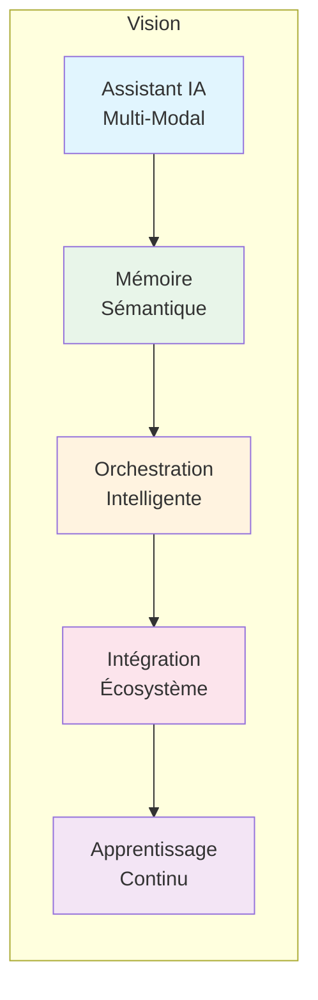

---

### 🏗️ Architecture Globale

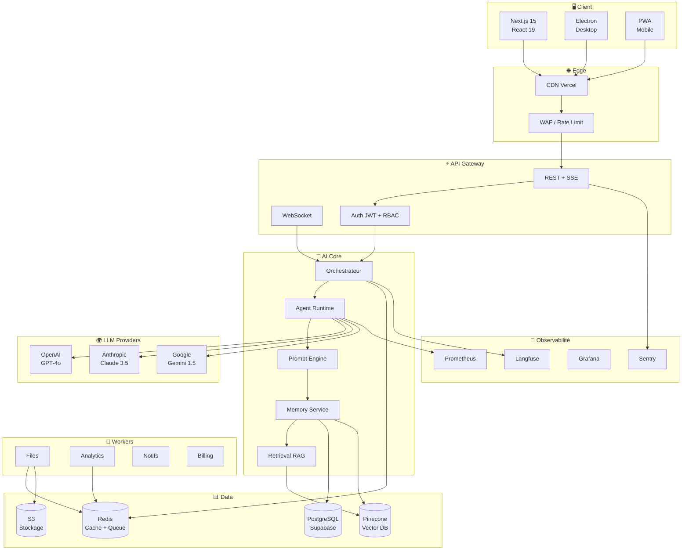

---

### 🛠️ Stack Technique

| Couche | Technologie | Rôle | Justification |
|--------|-------------|------|---------------|
| **Frontend** | Next.js 15 + React 19 + Tailwind 4 + shadcn/ui | UI moderne, SSR, RSC | Performance, SEO, design system |
| **State** | Zustand + Immer | Global state minimal | TypeScript-first, middlewares |
| **Desktop** | Electron + Vite | App native macOS/Windows | Codebase partagée |
| **Auth** | Supabase Auth | JWT, OAuth2, MFA, RLS | SOC2, intégration PG |
| **API** | Next.js API Routes + Edge | Gateway unifiée | Serverless, auto-scale |
| **AI SDK** | Vercel AI SDK | Abstraction multi-LLM | Streaming, tool calling, type-safe |
| **Vector DB** | Pinecone Serverless | Embeddings + recherche | <50ms latence, hybrid search |
| **Cache/Queue** | Redis (Upstash) | Sessions, jobs, pub/sub | Serverless, structures riches |
| **Object Storage** | AWS S3 / R2 | Fichiers, assets | 11 9s durabilité, CDN |
| **Queue Engine** | BullMQ | Workers async | Retry, scheduling, DLQ |
| **Observability** | Langfuse + Prometheus + Grafana + Sentry | LLM tracing + metrics + logs + errors | Standard industrie |
| **CI/CD** | GitHub Actions + Vercel | Build, test, deploy | Matrix builds, edge deploy |
| **Infra** | Terraform + Docker | IaC, local dev | Reproductible, testable |

---

### 🔌 Services (18 Microservices)

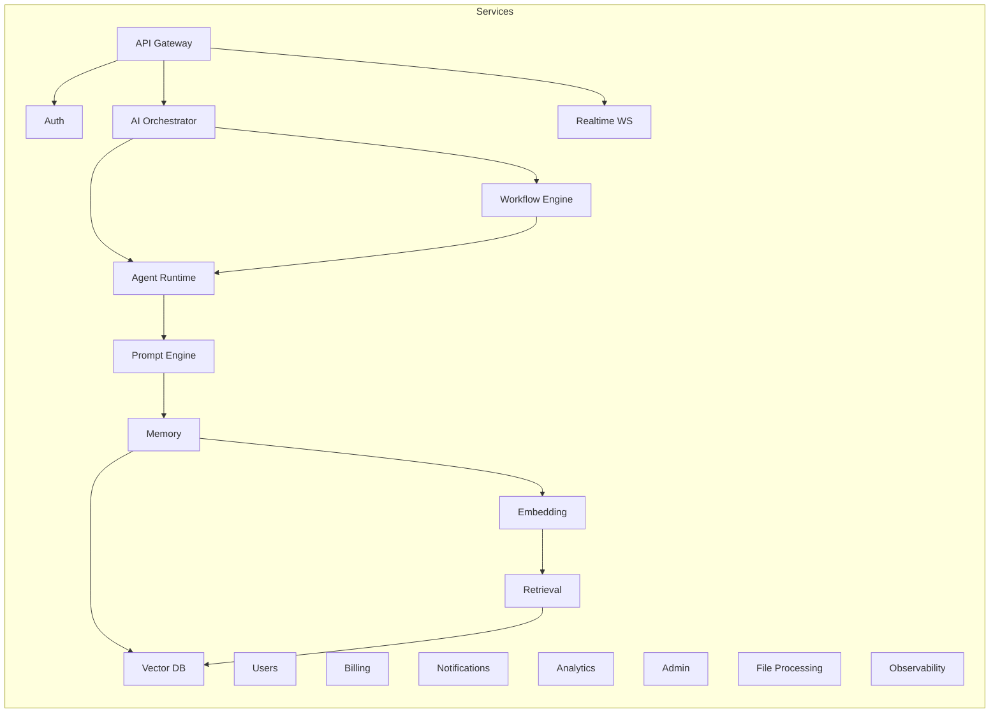

---

### 📈 Cas d'Usage & Valeur Métier

| Cas d'usage | Agents | Gain |
|-------------|--------|------|
| Analyse financière | Analyste + Data + Notification | **-80%** temps analyse |
| Génération de contenu | Rédacteur + Relecteur + SEO | **×5** productivité |
| Recherche intelligente | Retrieval + Synthèse + Citation | **95%+** précision |
| Ordonnancement | Planning + Calendar + Notification | **Zero** oubli |
| Support technique | Support + Tech + Escalation | **-60%** tickets |
| Veille stratégique | Veille + Analyste + Briefing | **Temps réel** |

---

### 💰 Coûts & Scaling (10K MAU)

| Poste | Mensuel |
|-------|---------|
| Infra (Vercel + Supabase + Pinecone + Redis + S3) | **~$1,436** |
| LLM (OpenAI + Anthropic) | **~$1,200** |
| **TOTAL** | **~$2,636** |

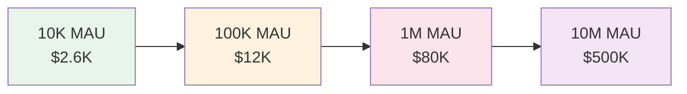

---

## PAGE 2 — DÉTAIL TECHNIQUE

---

### 🤖 Architecture des Agents

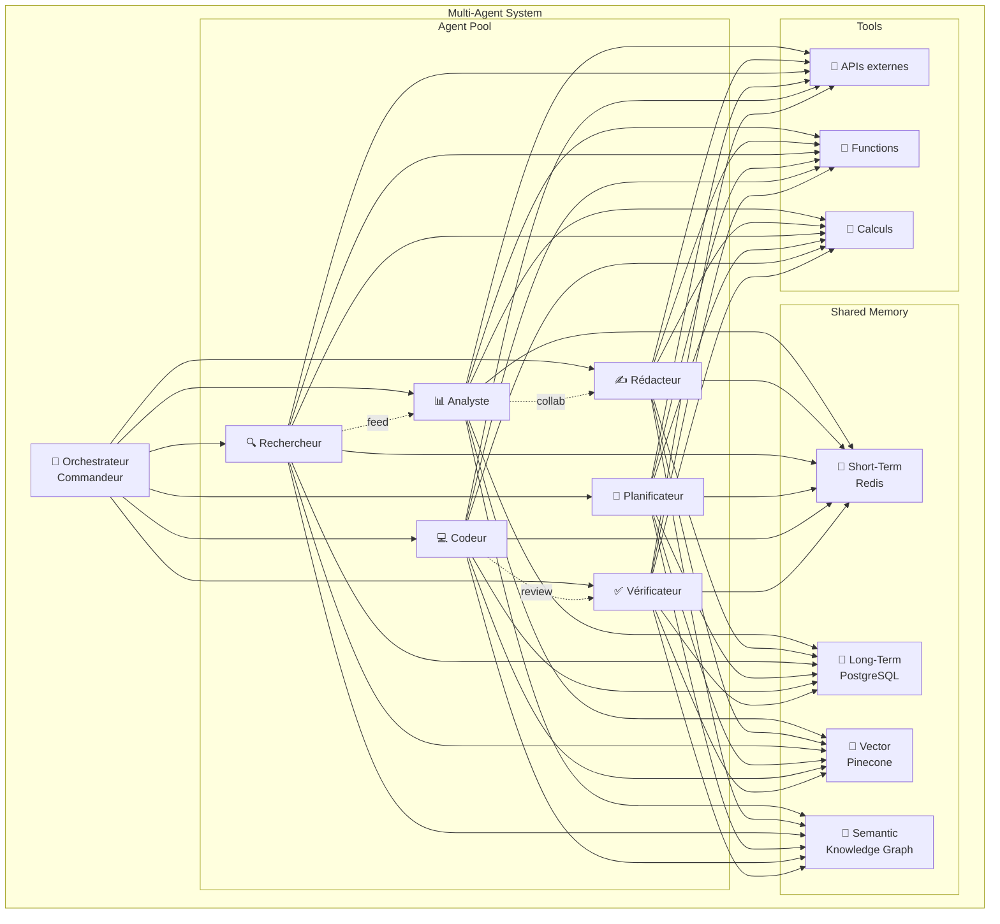

---

### ⚡ Agent Execution Loop

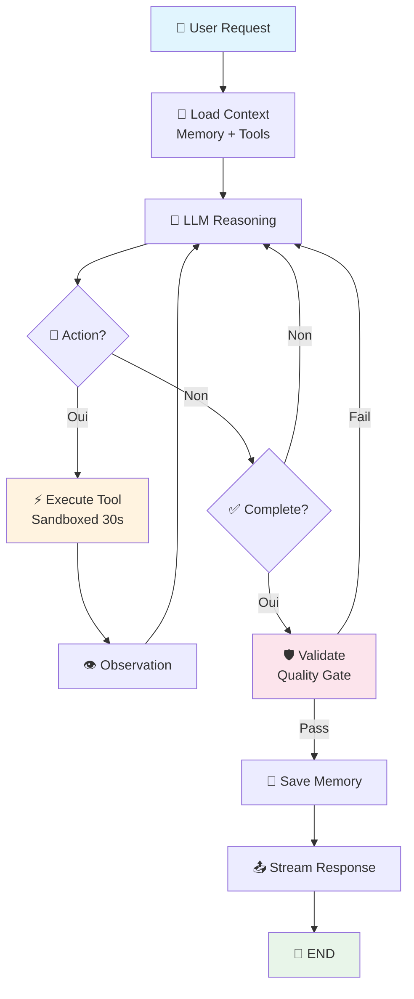

---

### 🧠 LLM Routing Intelligent

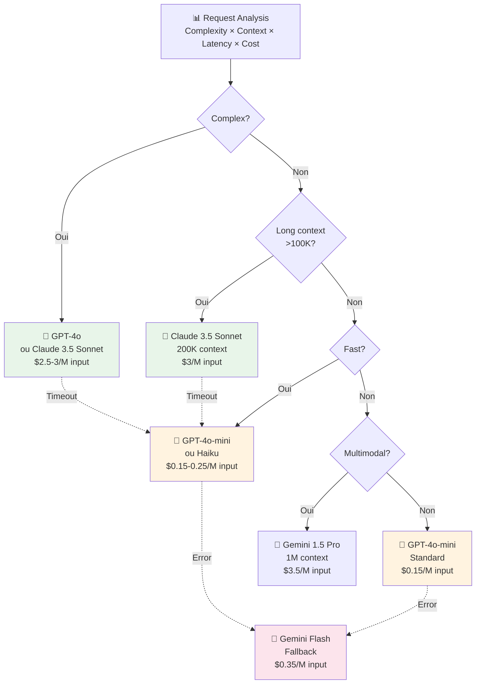

---

### 📚 Pipeline RAG Complet

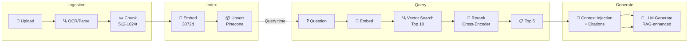

---

### 🛡️ Sécurité — Defense in Depth

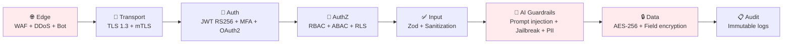

| Couche | Mécanisme | Priorité |
|--------|-----------|----------|
| Edge | Cloudflare WAF, Arcjet rate limit | 🔴 Critique |
| Auth | Supabase Auth, JWT RS256, MFA | 🔴 Critique |
| AuthZ | RBAC middleware, PostgreSQL RLS | 🟠 Haute |
| Input | Zod schemas, regex sanitization | 🟠 Haute |
| AI Safety | Prompt injection detection, output filtering, PII redaction | 🔴 Critique |
| Data | AES-256 at rest, field-level encryption | 🟠 Haute |
| Secrets | HashiCorp Vault, rotation automatique | 🟠 Haute |
| Audit | Append-only signed logs, GDPR compliant | 🟡 Moyenne |

---

### ☁️ Infrastructure Cloud

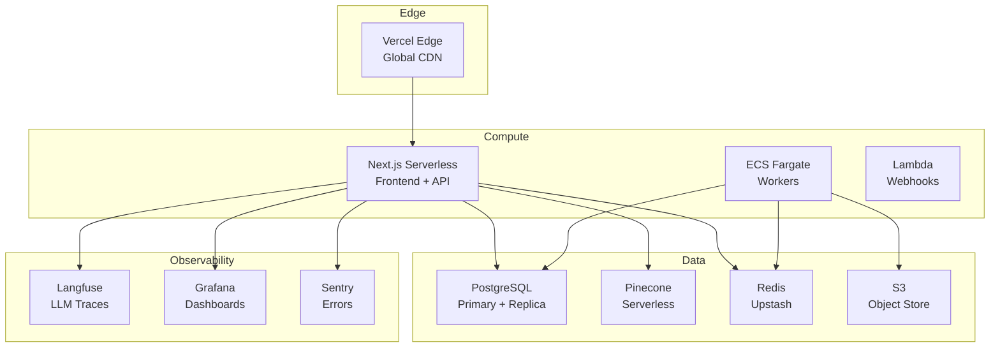

---

### 📊 Monitoring & Alerting

| Dashboard | Métriques clés | Audience |
|-----------|----------------|----------|
| **LLM Performance** | Latence P99, coût/requête, token usage, quality score | AI Engineers |
| **System Health** | CPU, memory, DB connections, queue depth | DevOps |
| **Business** | DAU, MRR, churn, feature usage | Product / Exec |
| **Agent Performance** | Success rate, execution time, tool usage | AI Engineers |
| **Security** | Auth failures, rate limit hits, anomalies | Security |
| **RAG Quality** | Precision@K, hallucination rate, MRR | AI Engineers |

| Alerte | Seuil | Canal | Escalade |
|--------|-------|-------|----------|
| API Error Rate | > 1% | PagerDuty | 5 min |
| LLM Latency P99 | > 10s | Slack | 10 min |
| Queue Depth | > 1000 | Slack | 15 min |
| Auth Failures | > 10/min | Security Slack | Immédiat |
| Hallucination Rate | > 5% | AI Team | 30 min |

---

### 🚀 Roadmap 2024-2027

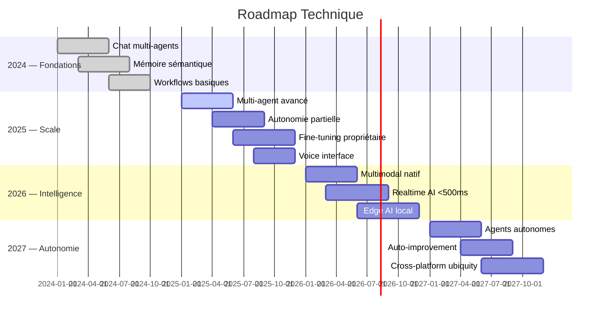

---

### 🎯 KPIs Architecture

| Pilier | Score | Preuve |
|--------|-------|--------|
| **Modularité** | ⭐⭐⭐⭐⭐ | 18 microservices découplés, chaque composant remplaçable |
| **Observabilité** | ⭐⭐⭐⭐⭐ | Tracing complet, coûts trackés, qualité mesurée en temps réel |
| **Sécurité** | ⭐⭐⭐⭐⭐ | 8 couches defense-in-depth, guardrails IA, audit immuable |
| **Scalabilité** | ⭐⭐⭐⭐⭐ | Horizontal scaling, serverless, 10K → 10M MAU |
| **Résilience** | ⭐⭐⭐⭐ | Circuit breakers, fallbacks multi-LLM, graceful degradation |
| **Optimisation** | ⭐⭐⭐⭐⭐ | Routing intelligent, caching 90%, batching -40% coûts |

---

> **"D'ici 2027, Hearst OS sera le système nerveux numérique de référence — orchestrant des milliers d'agents spécialisés, apprenant en continu, et multipliant la productivité humaine par 10."**

---

*Document généré le 2026-05-11 — Version 2.0*  
*Hearst OS Engineering Team*
